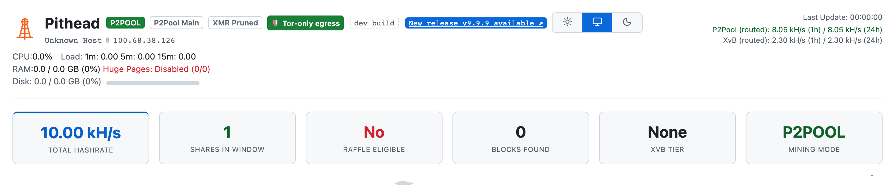
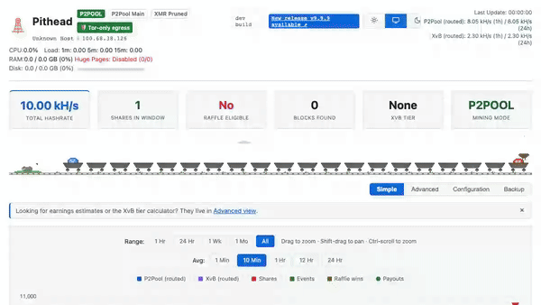
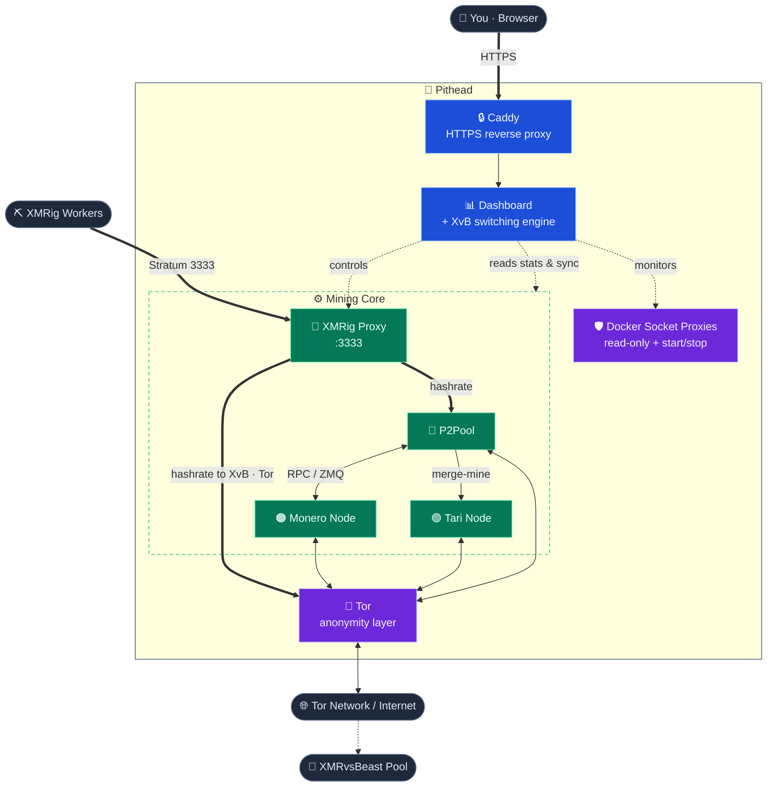

<div align="center">


# Pithead

### Private Monero + Tari merge-mining stack

[](https://github.com/p2pool-starter-stack/pithead/actions/workflows/ci.yml)
[](./LICENSE)


Docker Compose stack for Monero + Tari merge-mining on [P2Pool](https://github.com/SChernykh/p2pool),
with a [Monero](https://www.getmonero.org/) full node, [Tari](https://www.tari.com/) base node, and
a Tor daemon. The `pithead` script renders config, provisions Tor, and drives docker-compose.
It ships two ways: **Pithead OS**, a bootable appliance image for a machine you dedicate to
mining, and the **Compose stack** you run on a host you manage.

<picture>
  <source media="(prefers-color-scheme: dark)" srcset="./docs/images/launch/hero.png">
  
</picture>

</div>

---

## What it does

- ⛏️ **P2Pool payouts, Tari merge-mined.** Mines Monero on [P2Pool](https://p2pool.io/): no pool
  operator, no fee, rewards paid to your own wallet. Every hash can merge-mine Tari on the same
  work — the appliance's setup wizard asks, and a machine that declines mines Monero alone.
- 🧠 **XvB switching engine.** Watches the XMRvsBeast raffle and shifts hashrate to hold your tier,
  donating the minimum needed and routing the rest to your P2Pool payouts.
- 🧅 **Tor-first networking.** A built-in Tor daemon gives P2Pool an onion address, and the Monero
  and Tari nodes one each while they run locally; a host firewall drops any direct clearnet dial
  from the stack. All runtime egress routes over Tor by default; the opt-in exceptions are the
  clearnet initial sync and a node you run on another machine, which is dialled directly. The
  [privacy guide](docs/privacy.md) maps every connection.
- 🔌 **One endpoint for every rig.** Point all workers at a single address on port `3333`. No wallet
  address in the miner config; the stack routes the hashrate.
- 📊 **Live dashboard, with history.** Hashrate, the P2Pool/XvB split, the PPLNS window, and
  per-worker stats over HTTPS on your LAN — and a time-series store keeps blocks found, XvB credit,
  network difficulty, disk growth, and per-rig hashrate as trends, not just the latest reading.
- 🎛️ **Configure and tune from the browser.** Opt in with `dashboard.control.enabled` to edit
  `config.json` from a guided form — or raw JSON, with file upload — inspect and retune each rig,
  see how a rig's hashrate tracks each config version, one-click upgrade to a new release, and read
  the access and config-change audit logs. Every change is gated host-side behind a login. See
  [The Dashboard](docs/dashboard.md).
- ⚙️ **One config, tuned to your setup.** A local or remote Monero node, pruned or full, and a local
  or remote Tari node; the P2Pool tier (`main`, `mini`, or `nano`); XvB donation strategy;
  per-worker power and API settings; four alert channels; timezone, memory limits, and every privacy
  toggle — around 90 keys across 14 sections, all in one `config.json` and validated on every
  `apply`. Most have defaults you'll never
  touch. See [Configuration](docs/configuration.md).
- 💡 **Energy-aware earnings.** Set your electricity cost and coin prices — typed in, or fetched
  live from CoinGecko over Tor with the opt-in price feed — and add each rig's watts; the earnings
  card shows fiat estimates per coin, fleet power draw, efficiency in hashes per watt, and estimated
  profit after power, always stating which price the figures use.
- 📟 **Telegram operator bot.** Opt-in alerts for a downed node, a worker that dropped off, sync
  finishing, low disk, a clearnet leak, or a sustained hashrate drop — plus a daily digest and
  read-only commands (`/status`, `/hashrate`, `/workers`, `/earnings`). Routed over Tor. The same
  alerts also push to a generic JSON webhook or an [ntfy](https://ntfy.sh) topic. See the
  [Telegram guide](docs/telegram.md).
- 🔔 **Dead-man's switch.** An optional [Healthchecks.io](https://healthchecks.io/) ping tells you
  when the whole box goes dark — the one failure a monitor running *on* that box can never report.
- 💾 **Encrypted backups.** `./pithead backup` writes config, secrets, and onion keys to a single
  AES-256 archive (the blockchains too, with `--with-chains`); `restore` brings a box back on new
  hardware with the same onion address.
- 🚀 **Interactive setup.** `./pithead setup` checks dependencies, writes config, provisions Tor, and
  (on Linux) tunes HugePages for RandomX. It prompts before any GRUB change, then offers to start.
- 🔒 **Hardened defaults.** Non-root containers, SHA256-verified binaries, digest-pinned base and
  third-party images, localhost-only RPC, and two scoped Docker socket proxies: a read-only one for
  stats and a separate start/stop-only one for node-down worker failover.

---

## 📀 Two ways to run it

| | What you get | Start here |
|---|---|---|
| **Pithead OS** — the appliance | A bootable USB image that installs itself on a dedicated machine: no Linux to set up, configured from a browser, updated as one signed image that falls back on failure. | [The appliance guide](docs/appliance.md) |
| **The Compose stack** — DIY | The same stack on a host you manage (Ubuntu Server 24.04): you keep the OS, `pithead` drives Docker Compose. | The Quick Start below |

Same stack, same dashboard, same configuration either way. The appliance is the short road;
DIY is for a box that already does other things.

---

## 🚀 Quick Start

This is the DIY path. For the appliance, download `pithead-os-vX.Y.Z.img` from
[Releases](https://github.com/p2pool-starter-stack/pithead/releases) and follow
[the appliance guide](docs/appliance.md) instead — no Linux to set up, no command line to learn.

```bash
# Grab the latest release — pulls the published, tested images (no local build)
curl -fsSL https://github.com/p2pool-starter-stack/pithead/releases/latest/download/pithead.tar.gz | tar xz
cd pithead
cp config.minimal.json config.json   # then set your Monero + Tari payout addresses
./pithead setup
```

> For every tunable, copy `config.reference.json` instead. To build from source (a `dev`
> build), e.g. to contribute, see [Install from source](docs/getting-started.md#alternative-build-from-source).

> NOTE: Prereqs are Ubuntu Server 24.04 LTS, 16 GB+ RAM, an SSD (~330 GB pruned / ~530 GB full
> minimum with both nodes local; the chains grow ~100+ GB/year, so 2–4 TB avoids a later resize),
> and your Monero + Tari payout addresses. Running a node on another machine cuts the disk budget —
> full sizing in [Hardware Requirements](docs/hardware.md).

`setup` checks dependencies (and offers to install them on Ubuntu), asks for your wallet
addresses, provisions Tor, tunes HugePages for RandomX, and offers to start the stack. Then:

1. Open the dashboard at `https://<your-hostname>` (the script prints the exact URL).
2. Wait for the initial sync. On first boot the dashboard shows Sync Mode while the Monero and Tari
   nodes catch up, then switches to the live view once both are synced. p2pool and the proxy stay
   parked until then.
3. Point any [XMRig](https://github.com/xmrig/xmrig) rig at `YOUR_STACK_IP:3333` — no wallet
   address in the miner. [RigForge](https://github.com/p2pool-starter-stack/rigforge) provisions a
   tuned worker in one command.

<div align="center">
  
</div>

Full walkthrough: [docs/getting-started.md](docs/getting-started.md)

> NOTE: Already have a synced Monero node? Point the stack at your existing blockchain to skip the
> wait. See [Reusing an existing node](docs/configuration.md#reusing-an-existing-node).

---

## 📚 Documentation

| Guide | What's inside |
|---|---|
| **[Pithead OS — the appliance](docs/appliance.md)** | Write a USB stick, install on a dedicated machine, configure from a browser. The whole stack as one signed image with automatic fallback. |
| **[Getting Started](docs/getting-started.md)** | The DIY path: prerequisites, install, first-run setup, and what to expect while the node syncs. |
| **[Hardware Requirements](docs/hardware.md)** | Minimum vs. recommended specs for the stack host (CPU, RAM, disk, network), and how to run leaner. (Miner specs live in [RigForge](https://github.com/p2pool-starter-stack/rigforge).) |
| **[Configuration](docs/configuration.md)** | Every `config.json` key, applying changes safely, reusing an existing node, and remote Monero or Tari nodes. |
| **[The Dashboard](docs/dashboard.md)** | Sync Mode, a tour of the live operational view, and the opt-in control channel: editing config, one-click upgrades, and the audit logs from the browser. |
| **[Connecting Miners](docs/workers.md)** | Point any existing rig at the stack, or spin up a tuned miner with [RigForge](https://github.com/p2pool-starter-stack/rigforge). |
| **[Architecture](docs/architecture.md)** | The eleven services (nine on a default install), the privacy model, and the algorithmic XvB switching engine. |
| **[Privacy & Network Egress](docs/privacy.md)** | Every off-box connection: what's Tor-routed, what's clearnet today, and how to harden it. |
| **[Operations & Maintenance](docs/operations.md)** | Full command reference, upgrades, backups, and troubleshooting. |

Browse the full index at **[docs/](docs/README.md)**. Contributing, or just want to know where a
subsystem lives? See the [repo map](docs/dev/repo-map.md).

---

## 🏗️ How it works

The stack defines eleven services via Docker Compose — nine on a default install: a Monero full
node, P2Pool, a Tari base node, an XMRig proxy (your single worker endpoint), Tor for anonymity, the
dashboard plus switching engine, a read-only Docker socket proxy (plus a tiny start/stop-only
control proxy), Caddy for HTTPS, and two opt-in view-only wallets that confirm payouts on-chain.
Either node drops out when you point the stack at one running elsewhere.



Read the full breakdown, including the privacy model and the algorithmic switching engine, in
[Architecture](docs/architecture.md).

---

## 🛠️ Common commands

Everything runs through `pithead` (`./pithead help` lists it all):

| Command | Description |
|---|---|
| `./pithead setup` | First-time interactive setup. |
| `./pithead apply` | Preview and apply `config.json` changes. |
| `./pithead up` / `down` / `restart` | Start / stop / restart the stack. |
| `./pithead upgrade` | Re-render config, then pull (bundle) or rebuild (source) the images and restart — see [Updating](docs/operations.md#updating-the-stack). |
| `./pithead logs [service]` | Follow logs (all, or one service). |
| `./pithead status` | Container status + health-check of every expected service (warns on anything down). |
| `./pithead doctor` | Read-only health report (deps, Docker, AVX2, HugePages, RAM/disk, onion state). |
| `./pithead version` | Print the installed stack version on one line (offline; also `-V` / `--version`). |
| `./pithead backup` | Save config, secrets, the Tor onion keys, and the dashboard's database to a passphrase-encrypted archive under `backups/` (`--with-chains` adds blockchain data; `--no-encrypt` writes plaintext; `-y` / `--yes` skips the prompts). |
| `./pithead restore <archive>` | Restore those files from a backup archive, encrypted or plaintext (asks before overwriting; `-y` / `--yes` skips the prompt). |
| `./pithead rotate-secrets` | Regenerate the stack's internal credentials after a suspected leak — see [Rotating the internal secrets](docs/operations.md#rotating-the-internal-secrets). |

Commands chain in one call (`./pithead apply upgrade` runs both, stopping on the first failure;
nonsense like `up down` is rejected before anything runs), and `source pithead-completion.bash`
adds bash/zsh tab-completion — see
[Operations › Chaining commands](docs/operations.md#chaining-commands).

Full reference: **[Operations & Maintenance](docs/operations.md)**.

---

## 🤝 Donate

If this stack saved you time, donations to this XMR wallet are appreciated:

```
486aGn4qhH1MkaASjnEWMDN7stD1SVtPF5fvihmjffeBE5ACL1u1jU95KxiqmoiaPZMexi4R4W11MLXut66XWVVF8wjAE5R
```

## 📄 License

Pithead's own code is provided "as-is" under the [MIT License](./LICENSE). Bundled
third-party components keep their own licenses (two, `p2pool` and `xmrig-proxy`, are GPLv3,
shipped unmodified as separate containers). See
[`THIRD_PARTY_LICENSES.md`](./THIRD_PARTY_LICENSES.md).
