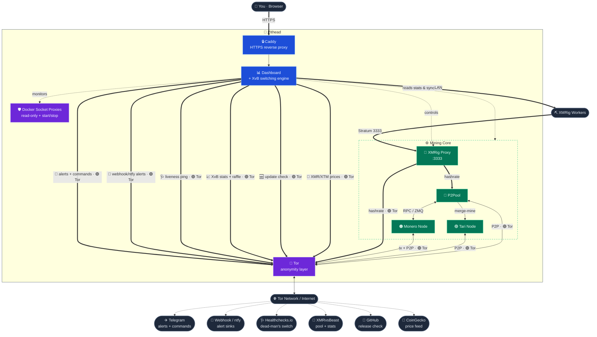

# Architecture

The stack defines eleven containerized services under Docker Compose; a default install starts nine.
Two are opt-in view-only wallets for payout confirmation, and either bundled node drops out when you
point the stack at one running elsewhere. This doc lists each service and how they connect.

The services provide a Monero full node, P2Pool sidechain mining, Tari merge-mining, a single worker
endpoint, and a monitoring dashboard. A node running here routes its P2P and transaction traffic
over Tor, and no public port forwarding is required; a node you point at over the network is reached
directly instead.

## The services

| # | Service | Role |
|---|---|---|
| 1 | **Monerod** | The Monero daemon (full node). Configured for restricted RPC and Tor transaction broadcasting. Runs only with `monero.mode: local` (compose profile `local_node`); in `remote` mode no container starts and P2Pool dials your external node's RPC/ZMQ instead. |
| 2 | **P2Pool** | The mining sidechain. Supports Main, Mini, and Nano pools. |
| 3 | **Tari Base Node** | The Minotari node, merge-mined alongside Monero. Runs only with `tari.mode: local` (compose profile `local_tari`); in `remote` mode no container starts, no Tari data dir is used, and P2Pool merge-mines against your external node's gRPC; with `off` no Tari container starts at all. P2Pool is still passed its merge-mine arguments until #1903 lands, so on an `off` machine today it points at a node that is not running. See [Hardware › Running a node elsewhere](hardware.md#running-a-node-elsewhere). |
| 4 | **XMRig Proxy** | The single stratum endpoint (`:3333`) all mining hardware connects to; the switching engine reconfigures it at runtime. |
| 5 | **Tor** | Provides SOCKS5 proxies and hidden services (onion addresses) for the other containers. |
| 6 | **Dashboard** | The web monitoring UI and the algorithmic switching engine. |
| 7 | **Docker Proxy** | A **read-only** proxy onto the Docker socket so the dashboard can read container stats/logs — no write access. |
| 8 | **Docker Control** | A second, minimal socket proxy scoped to **only** `start`/`stop` (nothing else — not create/kill/exec/reads), so the dashboard can reject workers when a node is down (Issue #31), hold p2pool + xmrig-proxy until the chains finish syncing (Issue #35), switch a clearnet-syncing node back to Tor once it's synced (Issue #234), and, opt-in via `dashboard.fail_closed`, hold p2pool + xmrig-proxy again on an unrecoverable dashboard health failure (Issue #490), restart `tor` when the opt-in guard self-heal (`tor.auto_heal`) finds clearnet egress stuck, and restart `monerod` right after that heal so it re-dials through the fresh Tor. Kept separate so its write grant can't widen the read-only proxy. |
| 9 | **Caddy** | A reverse proxy that serves the dashboard over HTTPS (automatic local TLS) on the LAN. |
| 10 | **Monero Wallet-RPC** (`wallet-rpc`) | Opt-in: runs only when `monero.view_key` is set (compose profile `payout_confirm`). A view-only `monero-wallet-rpc` against the local node, so the dashboard can confirm P2Pool payouts on-chain. See [Dashboard › Payout confirmation](dashboard.md#payout-confirmation). |
| 11 | **Tari Console Wallet** (`tari-wallet`) | Opt-in: runs only when `tari.view_key` is set (compose profile `tari_payout_confirm`). A view-only `minotari_console_wallet` against the local Tari node, confirming merge-mine payouts on-chain. See [Dashboard › Payout confirmation](dashboard.md#payout-confirmation). |

## High-level diagram

Reading the diagram: thick arrows carry inbound connections and every path that **leaves the box** —
each egress edge is tagged with its route, and **🟢 Tor** means it exits through the Tor daemon (a Tor
exit IP, never your host's). Dotted arrows are the dashboard's internal control and monitoring, which
never leave the machine. The dashboard makes six outbound internet calls — the **Telegram** bot
(alerts + commands), the **webhook/ntfy** alert sinks, the **Healthchecks.io** liveness ping, the
**XvB** calls (stats, raffle registration, winners), the **GitHub** release check, and the opt-in
**CoinGecko** price feed (`dashboard.energy.price_feed`, XMR + XTM spot prices) — and all six are
Tor-routed, so enabling any of them never reveals where your stack runs (the webhook/ntfy sinks have
a `notifications.tor: false` opt-out for LAN endpoints Tor can't reach; see
[Telegram › Webhook and ntfy sinks](telegram.md#webhook-and-ntfy-sinks)). The dashboard also polls
each rig's RigForge API for worker stats, and config applies travel the same path — dialed by the
host-side control runner, so the rig tokens never enter the dashboard container (#185). Both are
direct **LAN** connections to your rigs; they don't route over Tor, so they carry no Tor tag. Node
colors group services by role: 🟦 control plane (Caddy, Dashboard), 🟪 privacy and isolation (Tor,
Docker socket proxies), and 🟩 the mining core.

Each node has its own local/remote switch. With `monero.mode: remote` the bundled 🟠 Monero node
isn't started and P2Pool dials your external node's RPC/ZMQ; with `tari.mode: remote` the 🟣 Tari
node isn't started and P2Pool merge-mines against your external node's gRPC. Both add a path that
leaves the box and is deliberately **not** Tor-routed — P2Pool bridges those legs onto direct
connections, in plaintext — so keep a remote node on your LAN or behind WireGuard. The Tor-only
egress firewall backs that up for the bridged containers, dropping any destination outside the
private ranges; the host-networked dashboard, which polls a remote Tari node for sync state, sits
outside those rules.

> The one exception is **optional clearnet initial sync** (`monero.clearnet_initial_sync` /
> `tari.clearnet_initial_sync`, default **off**): while active, that node's P2P leaves Tor to sync
> faster and its IP is exposed until it finishes, after which it reverts to Tor automatically (#234).
> The Telegram bot alerts you the whole time it's exposed. See [Privacy](privacy.md).

## Privacy by design

The stack is Tor-first. The Tor daemon provides a hidden service (onion address) for P2Pool always,
and for the Monero and Tari nodes whenever they run locally — a node running elsewhere accepts its
own peers, so no onion is published for it. Inbound connectivity needs no public IPv4 port
forwarding. Monero and Tari route their P2P and transaction traffic over Tor, and the clearnet DNS
lookups those nodes formerly leaked are closed (monerod checkpoints/blocklist/update-check, Tari DNS
seeds + Pulse). Every published node port binds `127.0.0.1` by default — the Monero RPC (`18081`),
the Monero ZMQ feed (`18083`), and the Tari base-node gRPC (`18142`) — each opened to the LAN by its
own switch: `monero.rpc_lan_access`, `monero.zmq_lan_access`, `tari.grpc_lan_access`.

Two outbound yield paths used clearnet in v1.0 and exposed the host IP: P2Pool's outbound sidechain
peers and XvB donation mining. As of v1.1 both route over Tor by default, each with an opt-out
(measured cost ~10 % of yield on `mini`; see the
[Tor-vs-clearnet benchmark](benchmarks/tor-vs-clearnet.md)). The one-time install and image pulls
reveal the host IP once. See [Privacy & network egress](privacy.md) for the connection-by-connection
map and the remaining lock-down steps.

## Security posture

- **Containerized, non-root where it counts, least-privilege.** Every daemon that touches the
  network or the chains — `monerod`, P2Pool, the Tari node, `xmrig-proxy`, the dashboard, Tor —
  runs its main process as a non-root user, and pithead chowns each bind-mount to the uid its
  container uses, so a breakout or RCE in any of them lands as an unprivileged user. Caddy and the
  two Docker socket proxies are the exceptions: they run as uid 0 inside their containers, which is
  why they hold no chain data, drop every capability, and sit on host-loopback-only ports. Where a
  privilege is genuinely needed (e.g. P2Pool's memory locking) it's granted narrowly: P2Pool relies
  on an unlimited `memlock` ulimit rather than running privileged. The leaf services (Caddy, the
  dashboard, the two Docker socket proxies, `xmrig-proxy`, and the two view-only payout wallets) run
  with `no-new-privileges`, and all of them drop every Linux capability (`cap_drop: [ALL]`). Caddy
  keeps only `NET_BIND_SERVICE` so it can bind `:80`/`:443`. The dashboard writes its history
  database as that non-root user into its (matching-owned) volume, so it no longer needs root's
  file-permission capability and drops all caps like the others. Every service runs with a
  read-only root filesystem (#377): each process can write only to its own data mount (blockchain
  DBs, Tor's keys, the dashboard's history, Caddy's certs) plus a small, size-capped ephemeral
  `tmpfs` (`noexec`, wiped on restart) for rendered configs and scratch. A compromised process
  cannot stage tooling in, or persist changes to, its container image.
- **Mining endpoint stays on the LAN.** The stratum port your rigs connect to (`p2pool.stratum_port`, default `3333`) is meant for
  your local network, never the public internet. It's published on all interfaces by default so LAN
  rigs work without extra config; narrow it with `p2pool.stratum_bind` (a specific LAN IP, or
  `127.0.0.1`) and firewall it to your LAN. See [Connecting Miners › Firewall](workers.md#firewall).
- **Verified binaries.** Third-party binaries are SHA256-verified during the image build.
- **Pinned versions.** Service images and binaries are pinned to known-good versions.
- **Hardened dashboard.** Security headers (a restrictive `Content-Security-Policy`,
  `X-Frame-Options: DENY`, `nosniff`, `Referrer-Policy`) and a sanitized error handler. It reaches
  Docker only through socket proxies, never the raw socket: a read-only one for stats/logs, and a
  separate control proxy scoped to `start`/`stop` only (its ruleset denies create/kill/exec and all
  reads). Splitting them means the write grant needed for node-down worker failover can't widen the
  read-only proxy's access. General Docker write access stays off. Both proxies are **isolated off
  the mining bridge** (#345): they sit on their own network and are published only to the host
  loopback, so the host-networked dashboard reaches them but no mining container can — a compromised
  `monerod`/`tari`/`p2pool`/`xmrig-proxy` cannot read other containers' env (inspect) or start/stop
  the stack through them.
- **Every response the dashboard reads has a ceiling** (#660, #1347, #1360). The dashboard pulls
  from a dozen places: GitHub's release feed, the price feed, the XvB API, its own `xmrig-proxy`,
  `monerod` and the two view-only wallets, each rig's API, and container logs and inspect data
  through the read-only Docker proxy. Every one of those reads stops at a size cap and gives up
  rather than buffer whatever arrives, so a broken or hostile endpoint cannot exhaust the
  dashboard's memory by answering a small request with a huge body. A refusal is treated like any
  other unreachable endpoint — the panel keeps its last good value, and one oversized answer never
  takes down the poll for everything else. The caps sit orders of magnitude above any real payload,
  and the container-log cap scales with the number of lines you asked for (`LOG_TAIL_LINES`),
  because a ceiling set too low is the worse failure: it presents as a broken daemon rather than as
  a refusal. The reads on the box are bounded for the same reason the ones leaving it are — "our own
  container" describes who *serves* a body, not who *wrote* it. `xmrig-proxy`'s summary is assembled
  from what miners advertise to it, container logs carry miner-supplied worker names and pool
  messages, and a remote `monerod` is someone else's server on someone else's network.
- **Locked-down config.** `config.json` is created `chmod 600` (owner-only), and the internal RPC
  proxy token is generated once and preserved across re-runs.

---

## Algorithmic switching

The dashboard distributes hashrate centrally rather than requiring per-rig pool configuration. All
workers connect to one endpoint, the `xmrig-proxy` service on port `3333`, and the decision engine
reallocates that hashrate between P2Pool (zero-fee Monero + Tari payouts) and XMRvsBeast (XvB) bonus
rounds. It donates the minimum needed to hold the target tier and routes the rest to P2Pool.

### How the engine decides

1. **Tier targeting.** The engine picks which XvB donation tier to aim for, set by
   `xvb.donation_level`:
   - `auto` (default): the highest tier your current hashrate can sustain.
   - a specific tier: `donor`, `vip`, `whale`, or `mega`. A specific tier is honored even if your
     hashrate is too low to hold it, in which case the dashboard shows a **⚠ Hashrate low for tier**
     badge.

   The four tiers and the donation hashrate each requires, which you must sustain on both your
   1-hour and 24-hour donation averages (as measured by XMRvsBeast), are set by the XvB raffle:

   | Tier | Donation hashrate to hold it |
   |---|---|
   | `donor` | **1 kH/s** (1,000 H/s) |
   | `vip` | **10 kH/s** (10,000 H/s) |
   | `whale` | **100 kH/s** (100,000 H/s) |
   | `mega` | **1 MH/s** (1,000,000 H/s) |

   > NOTE: the name "VIP" is overloaded. The `vip` tier above is a donation level (10 kH/s). Don't
   > confuse it with the dashboard's **Raffle Eligible** box. That box turns green only when you're set
   > up to actually win and collect a payout: donating at least the `donor` tier (on credited 1h+24h,
   > the same threshold tracked by **Current Tier**) and holding a P2Pool PPLNS share. XvB's bare rule
   > calls just-having-a-share a "VIP"; the dashboard is stricter, so a green "Yes" means a win is
   > actually paid. See the [Dashboard](dashboard.md) guide.

   Because the XvB raffle picks winners at random, donating above a tier's threshold earns nothing
   extra. The engine donates only enough to hold the target tier and routes the rest to P2Pool.

2. **Dynamic proxy reconfiguration.** A feedback controller watches your measured 1h / 24h donation
   averages and reconfigures the `xmrig-proxy` to send just enough time to XvB to stay in tier:
   ramping donation up when you fall behind and easing off as you catch up, with the remainder going
   to P2Pool. The controller edits the proxy config only; your workers keep their existing connection
   to `3333` and need no changes.

3. **Round protection.** XvB terminates a won bonus round if your credited 1h average drops below
   the round minimum while the round runs, so the controller guards wins two ways. It holds the 1h
   average a cushion above the tier threshold (5%, capped at 5 kH/s) rather than exactly on it,
   because XvB's credited average wanders a few kH/s below the setpoint even when your donation is
   steady. And for 90 minutes after a recorded raffle win — a round plus its tail — it refuses to
   ease the donation down, so a mid-round dip is never controller-assisted. Both guards spend a
   little extra donation to keep the round alive; the bonus a completed round mines to your wallet
   is worth far more than the cushion costs.

The result: the chosen XvB tier holds with minimal donation, and remaining hashrate mines Monero +
Tari on P2Pool. The dashboard's hashrate chart shades the P2Pool/XvB split over time.

---

## See also

- [The Dashboard](dashboard.md): Sync Mode and the live operational view.
- [Configuration](configuration.md): the `xvb.*` settings, data directories, and remote nodes.
- [Connecting Miners](workers.md): connecting hardware to the single `3333` endpoint.
