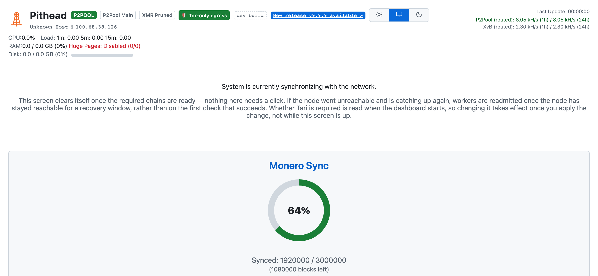
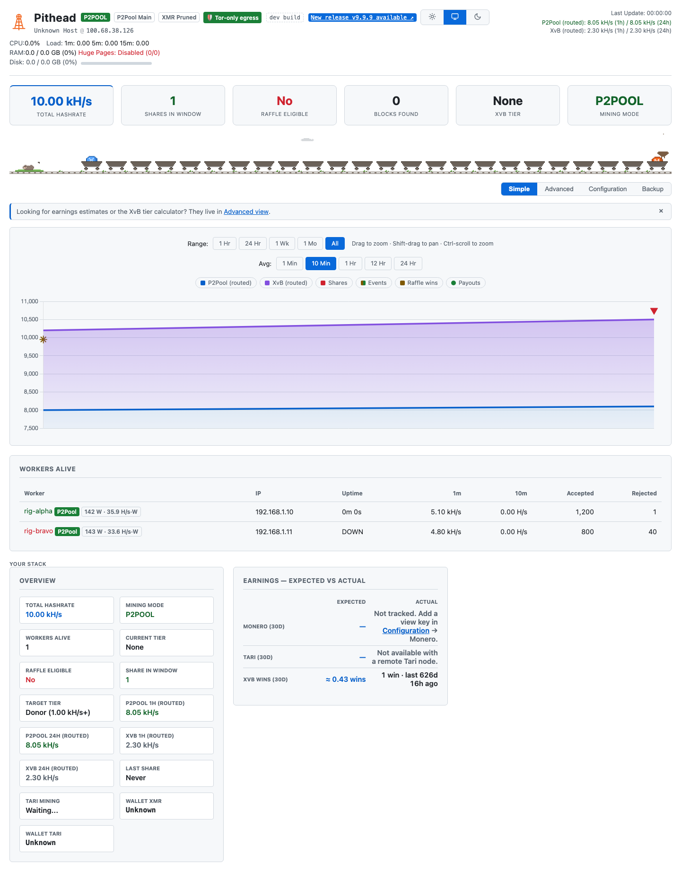
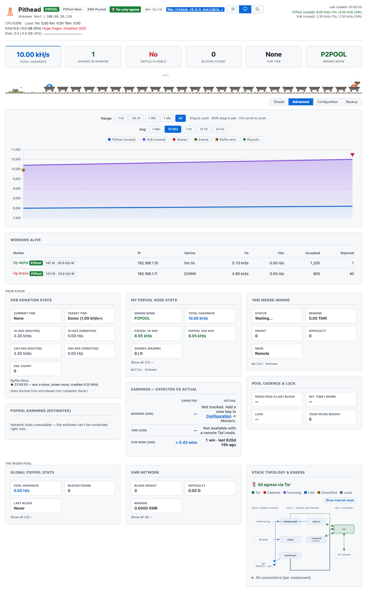

# The Dashboard

A single web page that monitors every service, charts hashrate, and shows the XvB switching engine's
decisions. Caddy serves it over HTTPS at `https://<hostname>` (the URL is printed when the stack
starts); with `dashboard.secure: false` it serves plain HTTP.

The dashboard has two states. While the nodes catch up to the network it shows Sync Mode. Once both
chains are synced it switches to the operational view.

---

## Sync Mode

The dashboard shows Sync Mode the first time you start the stack, or any time the Monero or Tari
node is still catching up. A `Syncing...` badge appears next to the hostname, the headline reads
*"System is currently synchronizing with the network,"* and no hashrate is routed yet.

The screen also says what it is waiting on, because two of the clocks involved are not the progress
bars and an operator watching only those reads a working machine as a stuck one. If the node went
unreachable and is catching up again, workers are readmitted once the node has stayed reachable for
a recovery window rather than on the first check that succeeds — a machine starting for the first
time has no rejected workers, so that wait belongs to a node that dropped out, not to a first run.
And `dashboard.tari_required` is read when the dashboard starts, so changing it takes effect once
you apply the change, not while the screen is up.

<picture>
  <source media="(prefers-color-scheme: dark)" srcset="./images/launch/sync.png">
  
</picture>

Sync Mode gives each chain its own progress card:

- **Monero Sync**: verified block height vs. the network tip, with blocks remaining. A green check
  means the chain is caught up. It also shows Pruned or Full mode and the on-disk DB size (also in
  the **XMR Network** panel of the operational view) — local node only; with `monero.mode: remote`
  the mode reads `Unknown`, since the stack doesn't probe a node it doesn't run — so you can confirm a reused chain matches your
  `monero.prune` setting.
- **Tari Sync**: the same, as a percentage ring, for the Minotari chain.

The top bar shows live host telemetry throughout: CPU, load average, RAM, HugePages (to confirm
RandomX optimization is active), and disk usage, for watching resources during the initial download.

A Monero or Tari node cannot mine until it has downloaded and verified the blockchain. On a first
run that takes a few hours to over a day, depending on hardware, disk, and network. Once the required
chains report synced, the dashboard swaps Sync Mode for the operational view and mining begins — no
refresh or restart needed.

While the chains sync, the dashboard keeps `p2pool` and `xmrig-proxy` stopped (a `Miner held (sync)`
badge shows next to the hostname) and starts them once the chains are ready. Running p2pool against
an unsynced node does nothing and floods Tari's logs with merge-mining chatter. Releasing the miner
is one-way: once it starts it stays up. By default the stack waits for both Monero and Tari. With
[`dashboard.tari_required: false`](configuration.md) it waits only for Monero and mines while Tari
finishes syncing in the background.

With `tari.mode: remote` the wait is on that node: the dashboard reads sync state from
`tari.remote.host` over gRPC, so a remote node still catching up holds the miner exactly as a local
one would. Set `dashboard.tari_required: false` if you'd rather not have someone else's node gate
your Monero mining.

> **Want to skip most of the wait?** Point the stack at an existing synced blockchain, or connect
> to a remote node. See [Configuration › Reusing an existing node](configuration.md#reusing-an-existing-node).

You can also follow sync progress from the command line. `./pithead status` prints each chain's
percent and blocks remaining while it's still syncing (no ETA — block rate isn't sampled), or watch
the node logs directly:

```bash
./pithead status
./pithead logs monerod
./pithead logs tari
```

---

## The operational view

Once both nodes are synced, the dashboard shows the operational view.

<picture>
  <source media="(prefers-color-scheme: dark)" srcset="./images/launch/simple.png">
  
</picture>

The page updates every 30 seconds, refreshing each panel in place rather than reloading. Scroll
position, the worker-table sort column, and the chart stay put between updates. View preferences —
theme, Simple/Advanced view, the chart's averaging window and series toggles, the worker-table
sort, the earnings tab, and the topology mesh toggle — are also
remembered across reloads. A poll that fails —
or hangs, as a dropped Tor circuit can — aborts after 25 seconds and shows a red banner naming the
timestamp of the data still on screen ("Disconnected — showing data from …"); it clears on the next
successful refresh.

### Top bar

A status strip across the top shows the hostname, host telemetry (CPU, load, RAM, HugePages, disk),
the last-update time, and 1h / 24h routed averages for both P2Pool and XvB (your split). The disk readout
switches from GB to TB once the volume reaches 1 TB, on the same scale in the Telegram `/system`
reply. An `XMR Pruned` / `XMR Full` badge sits with the other badges beside the stack name, showing
the bundled node's blockchain mode. It appears for a local node only — with `monero.mode: remote`
the pruning state is unknown, so neither badge is shown.

When the dashboard host is a name (not already an IP), the machine's IP shows beside it as
`hostname @ ip` (e.g. `pithead.local @ 192.168.1.42`), a way back in when the hostname doesn't
resolve from a phone or another LAN machine.

A version badge sits beside the hostname. A released build shows the version (e.g. `v1.3.0`); a
development or working-tree build shows a dashed `dev · branch @ commit` marker instead, so it is not
mistaken for a release. It appears on every screen, including Sync Mode, so a screenshot in a bug
report shows the build. To switch a `dev` build to a published release, see
[Switching a source checkout to release images](operations.md#switching-a-source-checkout-to-release-images).

When a newer Pithead release is out, a clickable `New release vX.Y.Z available ↗` badge appears next
to the version badge, linking to the GitHub release. The badge itself never updates anything. The
check is on by default and routed over Tor, so it does not reveal your IP. Turn it off with
`dashboard.check_for_updates: false` (see [Configuration](configuration.md#configuration-reference)).
The badge can never name the version you are already running: it is suppressed whenever the
advertised release is not strictly newer than the running one, so right after an upgrade it clears
with the restart instead of lingering until the next hourly check (#664).

With the [control channel](#configuration-view) enabled, an **Upgrade to vX.Y.Z** button appears
beside the badge — see [Upgrading from the dashboard](#upgrading-from-the-dashboard). Without it,
upgrade from the host per [Operations › Updating the stack](operations.md#updating-the-stack).

### Host & performance warnings

The top bar also surfaces the persistent host conditions that `setup` warns about, derived from
**live** metrics so they self-correct rather than going stale:

| Badge | Means | Fix |
|---|---|---|
| `⚠ HugePages off` | HugePages aren't reserved — RandomX hashrate is capped. | Run setup's tuning (or edit GRUB) and reboot; the badge clears once they're reserved. |
| `⚠ Low RAM (N GB)` | Under what this machine's workload wants: ~14 GB running both nodes locally, ~8 GB with one remote, ~3 GB with both remote, plus ~3 GB more when the appliance's built-in miner is on (its RandomX dataset holds that much alongside the stack's own). Remote nodes take their memory appetite with them; a nominal 16 GB machine reports ~15 and is fine for the full stack — but mining on the same box as both local nodes wants more. | Add RAM, point a node at a machine that has it, or mine from a separate rig. |
| `⚠ Memory pressure (N GB free)` | Live signal: under 1.5 GB actually available right now, whatever the machine's size — the next spike can OOM a container. | Check which service is growing on the System panel. |
| `⚠ No AVX2` | The CPU lacks AVX2, so RandomX mining is much slower. | A hardware limit; nothing to change at runtime. |
| `⚠ Payout wallet changed` | The wallet p2pool mines to changed within the last 72 hours (old → new, truncated). A confirmation if you changed it; an alarm if you didn't. | Verify `monero.wallet_address` in `config.json`; see [Operations › wallet changes](operations.md). The badge expires on its own after 72 h. |
| `Disk N% full` | The data filesystem is 85% or more used. | Free space, or move a `data_dir` — the chains keep growing. |
| `⚠ Disk N% full` | 95% or more used. A full disk corrupts monerod's database mid-write. | Act now: free space or move the chain to a larger volume. |

The first two also push a Telegram alert (`hugepages`, `low_ram`) when first detected, if the bot is
on; the wallet badge pairs with the `wallet_changed` alert; AVX2 is badge-only (see
[Telegram Bot](telegram.md#choosing-which-alerts-you-get)). All active warning badges are echoed in
the bot's `/status` reply.

### Hero band

A strip of headline KPIs sits below the top bar:

| KPI | Meaning |
|---|---|
| **Total Hashrate** | Your combined hashrate across all workers. |
| **Shares in Window** | Shares you currently hold in the P2Pool PPLNS window (green when above zero). |
| **Raffle Eligible** | Whether you'd actually win **and** collect an XvB raffle payout: green **Yes**, red **No**. (Full definition in [Overview](#overview).) |
| **Blocks Found** | P2Pool sidechain blocks your node has found. |
| **XvB Tier** | The donation tier you're currently holding. |
| **Mining Mode** | What your hashrate is routed to right now: P2Pool, XvB, or a split. |

While XvB is disabled the two raffle KPIs stand down entirely — the mode badge already says XvB
is off, and a strip of **N/A** and **None** would just repeat it.

### Mine cart train

A pixel-art train runs under the hero band on every view. It is the chart's history retold as
cargo: the strip splits the loaded chart window into equal intervals, one cart each (the newest
sits under the tipple chute on the right), and what landed in an interval rides in its cart as
a token coin poking over the rim:

| In the cart | Means |
|---|---|
| Empty cart | Plain hashing, nothing landed in this interval. |
| One orange ɱ coin | One or more P2Pool shares found. |
| A pair of orange ɱ coins | A block found. |
| Purple gem coin | A confirmed Tari payout — for solo merge-mining, the wallet's proof of a found Tari block. Needs [payout confirmation](#payout-confirmation) on for Tari. |
| Blue X coin | An XvB raffle win. |

Hover a cart for its exact interval and haul ("14:20–14:30 — 2 shares"). A cat sleeps by the
track; clouds drift past; the coins bob as the track rumbles. The train is decorative: shares,
blocks, and raffle wins all appear on the chart above with precise timestamps. The one thing
the train alone marks is the Tari gem coin — Tari payouts stay off the chart (see
[Payout confirmation](#payout-confirmation)), and the cart's hover tooltip is their timeline.
All motion stops when your system asks for reduced motion, and the strip disappears while
there is no history to show.

### Node status & failover

If a local node becomes unreachable, a red `monerod DOWN` or `Tari DOWN` badge appears in the top
bar (after 90 seconds continuously unreachable, clearing after 60 seconds of confirmed
reachability, so a momentary blip doesn't flap). Sync state is read from monerod's
`get_info` RPC and Tari's gRPC, so "down" means the node itself is unreachable, not just that a log
line changed.

A red `⚠ DB write failing` badge appears if the dashboard can't write to its SQLite database (full
or read-only disk, permissions problem). The dashboard keeps serving live data, but hashrate history,
shares, and stats won't survive a restart until it's fixed.

If the database file is found **corrupt** (malformed, e.g. after a container was recreated twice in
quick succession while a write was mid-flight), the dashboard heals itself rather than erroring
forever: it quarantines the bad file to `mining_data.db.corrupt-<UTC>` (kept for post-mortem), starts
a fresh database, and keeps running. A `db_reset` alert (Telegram and the other sinks) tells you
history before that point was cleared. Payout and XvB state rebuild from the chain and the live feed;
only the historical charts reset.

**Fail-closed miner hold.** By default, every health failure above — DB write failing, DB
corruption, a crash-looping container — only alerts; the dashboard is an observability layer, and
the mining datapath (`xmrig-proxy` → `p2pool` → `monerod`) runs independently of it. Set
[`dashboard.fail_closed`](configuration.md#configuration-reference) to `true` to hold the miner
instead, but only for genuinely **unrecoverable** failures: the DB self-heal above failing on its
own rebuild attempt (not an ordinary write blip, which stays alert-only), or the `dashboard`
container itself crash-looping. A red `Miner held (fail-closed)` badge shows while held, next to
`p2pool` and `xmrig-proxy`, stopped the same way the [Sync Mode hold](#sync-mode) does; unlike that
one-way sync gate, both containers start again on their own once the condition clears — no restart
needed.
The database also keeps three smaller series: pool block-found events, hourly monerod-DB-size and
host-disk-usage samples, and XvB-credited scalar samples taken roughly every 5 minutes. `/api/state`
serves them as `blocks`, `disk_growth`, and `xvb_history`, range-filtered the same way as
`share_stats`. The [mine cart train](#mine-cart-train) reads `blocks` and the chart's donation
overlay reads `xvb_history`; only `disk_growth` is persistence and API exposure alone, no
renderer yet.

While monerod is down, the dashboard rejects workers so they fail over to the backup pools you've
configured, rather than sitting idle on a stack that can't mine. A sustained outage stops the
`xmrig-proxy` container (a `Workers rejected` badge shows) and a confirmed recovery restarts it.
monerod is required to mine, so a monerod outage always rejects. Rejection never triggers for a
remote monerod — the stack doesn't probe a node it doesn't run, so that node always reads as
reachable and p2pool manages the connection itself. Readmission waits for monerod to be
confirmed healthy, not merely no-longer-down, so a dashboard restart mid-outage doesn't wave
workers back onto a stack that still can't mine.

A Tari outage never rejects workers, regardless of [`dashboard.tari_required`](configuration.md):
p2pool keeps mining Monero through a Tari-only outage, so kicking workers to their backup pools
over Tari alone would trade partial revenue for none. The outage still shows up — the Tari panel
and its alerts track it independently — but the fleet keeps mining. That holds for a remote Tari
node too, which the dashboard reaches over gRPC at `tari.remote.host`.

**Non-blocking Tari.** With `tari_required: false`, a Tari-only (re)sync doesn't take over the
screen: the operational view stays up, mining continues, and a `Tari syncing` badge shows Tari's
progress until it catches up and merge-mining resumes.

### Hashrate chart

A time-series chart of hashrate with selectable ranges (1h / 24h / 1w / 1mo / all history) that
switch without reloading. Shaded bands show the P2Pool/XvB split over time.

Every layer on the chart has a legend button that shows or hides it: the two routed bands, the
share triangles, the event diamonds, and the raffle stars. A hidden layer stays hidden across
reloads.

Diamond markers along the top flag **hashrate events** (#99): an amber one where total hashrate
dropped sharply and stayed down (an outage or a rig gone dark), a green one where it recovered.
Hover for the size of the drop. They mark the same transitions as the `hashrate_loss` Telegram
alert and survive a dashboard restart, so a drop that happened overnight is still on the chart in the
morning.

A gold **star** marks each **XvB raffle round your wallet won**, at the time the round was drawn.
Hover for the round type and the hashrate XvB credited the win at. Wins come from XvB's published
winners log (fetched over Tor, like every XvB read) and are stored permanently, so the stars stay on
the chart across restarts; the same wins are listed in the *XvB Donation Stats* card's
[Raffle Wins log](#xvb-tier-raffle).

An **Avg** control picks the hashrate-averaging window the chart plots: `1 Min` / `10 Min` /
`1 Hr` / `12 Hr` / `24 Hr` (the native windows xmrig-proxy reports). It is independent of the Range
control: the range sets how much *time* the x-axis spans; the averaging window sets how *smooth* each
plotted point is. Short windows (1–10 min) react within a poll or two, so a rig dropping or joining
shows up fast. Long windows (12–24 h) ride out the noise to show the trend. The choice is remembered
across reloads. Two things to know:

- `10 Min` is the default and matches the dashboard's headline hashrate.
- The longer windows need that much rig uptime to fill. Right after a (re)start, `12 Hr`/`24 Hr` read
  low and climb until enough history exists. Per-window history is kept only *going forward* from the
  version that introduced this control, so those lines are flat at the far-left edge of a long range
  until new data accumulates. Expected, not a fault.

### Overview

The summary panel pulls the key numbers together:

| Field | Meaning |
|---|---|
| **Total Hashrate** | Your combined hashrate across all workers. |
| **Mining Mode** | What the stack is routing hashrate to right now (e.g. P2Pool, XvB, or a split). |
| **Workers Alive** | How many rigs are connected and online right now. |
| **Current Tier** | The XvB tier you're currently holding, the one cleared by the **lower of your credited 1h and 24h** donation averages, so a recent hashrate drop shows up right away. |
| **Raffle Eligible** | **Yes** only when you're set up to both *win* and *collect* an XvB payout: you're donating at least the **donor tier** (1 kH/s on XvB's *credited* 1h **and** 24h averages, the same threshold as **Current Tier**) **and** you hold a P2Pool PPLNS share (XvB's "VIP" gate; without it a win is skipped and you take a fail). Reads **No** when donating but a gate is unmet, and **N/A (XvB off)** when XvB is disabled. Intentionally stricter than XvB's bare "VIP = just a share" so a green Yes means a win is paid. |
| **Share in Window** | Your shares in the current P2Pool PPLNS window. |
| **Target Tier** | The tier the engine is aiming for (from `xvb.donation_level`). If your hashrate can't sustain an explicitly chosen tier, a **⚠ Hashrate low for tier** badge appears. |
| **P2Pool 1h / 24h (routed)** | Time-weighted average hashrate the proxy actually routed to P2Pool. |
| **XvB 1h / 24h (routed)** | Time-weighted average hashrate the proxy actually **routed** to XvB. (The XvB-API *credited* figure, XvB's definitive record, appears in the **Advanced** view's *XvB Donation Stats* card.) |
| **Last Share** | Time since your last accepted share. |
| **Tari Mining** | Whether merge-mining of Tari is active and healthy. |
| **Wallet XMR / Wallet TARI** | Your configured Monero and Tari payout addresses, one card each. |

While XvB is disabled the five raffle/split tiles (Current Tier, Raffle Eligible, Target Tier,
XvB routed averages) drop out of the card, along with the header's XvB routed line and the whole
*XvB Donation Stats* card — one mode badge says XvB is off; nothing else repeats it.

### Earnings — Expected vs Actual

One compact table, shown in **both** views, that answers "am I earning what this hashrate should?"
— the comparison you'd otherwise assemble by hand from the Earnings tabs. Every row shares one
trailing **30-day** window:

| Row | Expected | Actual |
|---|---|---|
| **Monero + XvB (30d)** | The P2Pool linear estimate at your **30-day average** routed hashrate — the hashrate that actually ran the window — **plus** the XvB share for your current tier, when XvB is on and the estimate is fresh (the label drops "+ XvB" otherwise). Once enough of your wins have confirmed payouts to measure, the XvB share is XvB's published figure **scaled to what your wins actually paid** — the tooltip names the measured percentage and sample. Until then the published face value stands, and the tooltip says it is an upper bound. | All confirmed on-chain payouts over the window ([payout confirmation](#payout-confirmation)), with a percent-of-expected. The percent is withheld past 999% — a box idle for most of the window that still confirmed normal payouts would otherwise show a five-digit ratio against a near-zero expectation; the row's tooltip says so. |
| **Tari (30d)** | Expected **blocks** (hashrate × window ÷ Tari difficulty). Tari is merge-mined solo, so blocks are the honest unit — at fractions of a block per month, zero found is the normal case, not a fault. | Blocks found (each confirmed Tari payout is one solo-found block) and the XTM they paid. |
| **XvB wins (30d)** | Forecast wins for your tier, from XvB's own winners file: how often your tier's rounds are drawn ÷ how many qualifiers they have (summed with the lower donor rounds you also qualify for). While no tier is held yet — a fleet still ramping, or an operator weighing whether donating is worth it — the forecast uses your **target** tier instead. `—` while the file hasn't been read or has gone stale. | Raffle wins recorded in the window, and how long ago the most recent win on record landed (which can predate the window). |

Monero and XvB share one row **on both sides** deliberately: an XvB win pays out through ordinary
small payouts that can't be told apart from P2Pool payouts, so the confirmed actual always
contains the wins' XMR — a P2Pool-only expectation would overshoot on every winning box. Folding
XvB's published estimate into the expected side keeps the percent comparing like with like; the
wins row tracks only that wins keep landing.

Rows degrade honestly rather than guess: a stream with [payout confirmation](#payout-confirmation)
off shows the config key to set instead of a zero that would read as "earned nothing"; the XvB row
disappears when XvB is off; a `*` marks a window that reaches back past the oldest recorded payout.

Payouts swing with mining luck — P2Pool pays when the pool finds blocks, and solo Tari blocks are
rarer still. A sustained gap between expected and actual is the signal worth checking (workers
offline, a misconfigured payout address); a single quiet stretch is not.

### Workers Alive

A live table of every connected rig: worker name, IP, uptime, and per-worker hashrate over the 1m
and 10m windows — the same 10m window the chart's averaging toggle and Telegram's totals report —
for spotting a rig that has dropped off or is underperforming. A
worker whose direct API is unreachable still counts (with proxy-derived hashrate); a worker whose
miner has stopped drops out of the total. On a narrow screen the table scrolls sideways within its
card so columns stay readable. Until the first worker ever connects, the card shows a connect hint
("point each rig at `<host-ip>:3333`") in place of the empty table; see
[Connecting Miners](workers.md).

A [RigForge](https://github.com/p2pool-starter-stack/rigforge) rig that serves its enriched read API
adds a version badge and a row of chips next to its name — CPU governor and throttling state,
firmware board, HugePages, power draw and H/s-per-watt, the active tuning target and next autotune,
and watchdog temperature. Alarming states (throttling, thermal hold, a non-performance governor) read
red or amber; the rest are muted read-outs. Each chip shows only when the rig reports that field, so
a partial reading never leaves a blank, and a plain-xmrig rig shows no chips at all. If RigForge is up
but its miner isn't, the rig stays in the table with a **miner down** chip rather than dropping to
offline. Point the rig's descriptor at the enriched feed to turn this on — see
[Connecting Miners › RigForge enriched feed](workers.md#rigforge-enriched-feed).

With `dashboard.check_for_updates` on, a rig reporting a RigForge version older than the latest
published release also gets a clickable `rf vX.Y.Z available ↗` badge — the per-worker twin of the
header's new-release badge. Clicking it opens [Worker Inspect](#worker-inspect), where the
one-click upgrade lives (or the [adopt flow](#worker-inspect) that enables it); the release-notes
link moves inside that dialog as a secondary action. See
[Connecting Miners › RigForge new-release badge](workers.md#rigforge-new-release-badge).

Each rig shows accepted and rejected share counts (invalid shares folded into the rejected column as
`3 (+2 inv)` when present). A rig whose reject rate climbs past ~5% gets a red **⚠** flag next to its
rejected count — a rig submitting stale or bad shares (bad overclock, flaky network, clock drift)
rather than earning. Every column is sortable — the sorted column shows a direction arrow; click
**Rejected** to float the worst offenders to the top. Shares are cumulative since the proxy last started, so a brief early-run blip clears as good
shares accumulate.

Below the table, a **Proxy totals** line sums the stack's share health as reported by xmrig-proxy:
total accepted / rejected (with aggregate reject %) / invalid shares submitted upstream, plus the
best difficulty any share has hit. Hidden until the proxy submits its first shares.

The dashboard also persists these pool-wide counts as a time series: each 30-second poll stores how
much the accepted / rejected / invalid / expired counters advanced (a proxy restart re-baselines the
counters without corrupting the series), retained for 30 days like the hashrate history. `/api/state`
serves the series as `share_stats` and a trailing-24-hour reject rate as `reject_pct_24h` — a rate
over recent shares rather than the cumulative-since-proxy-start percentage in Proxy totals. The same
series drives the `high_reject_rate` [Telegram alert](telegram.md) when the trailing-hour rate
crosses 5%.

### Worker Inspect

With the control channel on (`dashboard.control.enabled`), a worker's name in the Workers Alive table
is a link. Click it to open **Worker Inspect** — a dialog with that rig's live telemetry, a hashrate
chart, an editor for the writable slice of its config, and the change history. Close it with the ✕
button, a click outside it, or Escape.

A **hashrate** chart sits above the editor: the rig's own `worker_history` samples (~5-minute
cadence) as a line, with **24 Hr / 1 Wk / All** range buttons — no "1 Mo" button, since at the
30-day retention it would show the same thing "All" already does. There's no averaging-window
toggle here (unlike the [main chart](#hashrate-chart)) — the per-rig table stores only one window.
Every config apply and rig upgrade in the change history below also marks the chart, so a step in
the line has a visible cause; hover a marker for what changed. A rejected or rolled-back attempt
still gets a marker, muted rather than dropped, since it tried but nothing on the rig actually
changed. A rig with no samples yet (just added, or never online) shows an empty-chart message
instead of a blank axis.

The editor covers the keys RigForge lets the control path change: `pools`, `DONATION`, `autotune`,
`watchdog`, `watchdog_interval_min`, and `max_temp_c`. Nothing else (identity, filesystem paths, API
ports, the control token) is editable from here. Two modes edit the same set of keys and submit the
same `{worker, changes}` request:

- **Table** (the default) — one row per writable key, prefilled from the last config the dashboard
  applied. Only the rows you touch go into the change.
- **JSON** — paste or edit the writable-keys object directly, for copying a whole profile between
  rigs or moving faster than the table allows. A **Load from file** control inside this mode reads
  a local JSON file into the textarea (`FileReader`, no upload) so you can push the same profile to
  several rigs without retyping it. A malformed edit is flagged inline before you click Apply.

Either way, click **Apply to rig**; RigForge validates the change, applies it, and — if the miner
doesn't come back to a live hashrate — rolls it back on its own. The panel shows the outcome
(applied / rejected / rolled back — or failed with the rig's reason, when its own rollback
path broke) and appends it to the history.

To make a rig editable, give it `host`, `token`, and (unless it's the default `8082`) `control_port`
in its [`workers.list[]`](configuration.md#configuration-reference) descriptor. A rig with neither
yet shows an **adopt form** instead of the editor: the control address prefilled from the IP the
proxy observed, `control_port` defaulted to `8082`, and a blank token field. The prefilled address
is a suggestion, not a fact — confirm or correct it before submitting; the rig's own name is not
enough proof of who is actually listening there. Submitting writes the descriptor through the same
control channel [the Configuration view uses](#configuration-view) (preview, then commit) — no
separate write path, and it can only ADD a new descriptor: it can never change the host or token of
a rig that already has one, so adopting rig #4 can't be used to repoint rig #1. The address also
can't resolve inside the stack's own network — loopback, link-local, or its own docker-bridge
subnet are refused, so an adopted rig has to be a real, distinct machine on your LAN. A rig with no
host yet, or the control channel off, still gets a plain explanation instead of the form.

The write is durable immediately, but a rig descriptor renders to no `.env` key, so adopting alone
never recreates any container — the dashboard reads its worker list once at process start, so this
editor may not appear until the dashboard itself restarts. The next config apply, a stack upgrade,
or a manual `./pithead restart` all pick it up; there is no faster dashboard-only way to force it
yet.

When the rig's [new-release badge](#workers-alive) shows and the rig is editable, an **Upgrade
rig…** button appears beside it: arm it, confirm, and the rig upgrades its own RigForge to the
latest release — the per-worker twin of the stack's one-click upgrade. The rig may rebuild its
miner (about ten minutes when the XMRig pin changed) and rolls itself back if the miner doesn't
come back live. The panel shows the outcome (applied / already up to date / rolled back / failed);
a repeat click inside the rig's own six-hour upgrade window reads as "throttled — retry later",
not an error. Like a config apply, the outcome appends to the change history — with the version it
moved to — so it isn't lost once the dialog closes, and both the hashrate chart above and the
hashrate-by-config table below attribute what the hashrate does next to the upgrade, not to
whatever config version happened to be active when it ran. See
[Connecting Miners › One-click rig upgrade](workers.md#one-click-rig-upgrade) for what the rig
must enable and how the target is derived.

Above the history, a line says **where the rig's current config came from** — the rig's own
account, not ours. The history table below it can only list what this dashboard did; this line is
the one place a change it never saw can show up. RigForge stamps each config change it records with
what applied it and a change id, and the dashboard looks that id up among the changes it recorded
for this rig. The lookup is by id, not a search of the table below, so it still answers on a rig
with more changes than that table shows:

- **Last changed from this dashboard** — the id matches a change recorded for this rig, and that
  change is recorded as having been applied. Only that outcome earns this line: every other one,
  including an outcome that was never recorded at all, gets one of the lines below instead.
- **Last change from this dashboard was rolled back** — the id matches a change this dashboard
  records as rolled back or failed. When a control change does not come back live, RigForge
  restores the previous config and stamps that restore with the *same* change id it just reverted,
  so the rig goes on naming a change it is no longer running. The rig is on whatever config came
  before it.
- **Last change from this dashboard is unconfirmed** — the id matches a change recorded for this
  rig, and no outcome was ever recorded for it. The dashboard waits on the rig for the result of
  a change it sends; when the rig has not said what it did within that wait, the change is recorded
  as acknowledged but unsettled. It may be running, or the rig may have rolled it back. This line
  says only that the record cannot tell you which, and it can still resolve on a later reading.
- **Last changed from another dashboard** — applied over a control channel, but with an id this
  dashboard has never issued. Another host drove this rig, or its record here is gone.
- **Cannot tell — this dashboard could not read its own history** — the dashboard's own change
  history would not open. It is the one line here that is about this dashboard rather than the rig:
  nothing was compared, so nothing is claimed either way. It says nothing about what the rig did.
- **Last changed on the rig itself** — applied on the rig, not over a control channel at all.
- **Last restored from a saved config** — someone ran RigForge's restore command on the rig. This
  covers only that command; the rig's own rollback after a failed change reads as the rolled-back
  line above, not as a restore.
- **No recorded config change** — the rig is running a config whose change it never recorded. A rig
  that has never been changed reads the same way as one whose config file was edited
  underneath RigForge, so the line claims neither.

A rig running plain XMRig, or a RigForge too old to publish the block, shows no line at all rather
than a guess. The words come from a fixed set the dashboard controls, never from the rig — a rig
cannot write its own provenance in text you would read as ours. The line carries the rig's own
timestamp beside it; hover it for the revision of the config the rig is running.

Read it as evidence, not as proof, and know the case it gets wrong. The line reports the last
change RigForge **recorded**. A config file edited underneath RigForge — by hand, with nothing
running to record it — is not a recorded change, so the line keeps naming whatever came before it.
On a rig where the dashboard applied the previous change, that reads as "Last changed from this
dashboard" while the rig runs something else.

**Two further checks answer that one directly.** The first, beside the provenance line, compares
what this dashboard last applied to the values the rig reports it is running, key by key, and
names each key that disagrees — "we applied `max_temp_c` 75, the rig is running 80". It needs
nothing recorded on the rig, so it sees the hand-edit the provenance line cannot.

Three things bound what the comparison claims, and each bound is deliberate:

- **It judges only keys this dashboard has set.** What it compares against is a record of the
  changes we pushed, not a copy of the rig's config, so a hand-edit to a key we have never applied
  has nothing to disagree with. The second check below is what covers that case.
- **It never compares pool passwords.** RigForge strips the pool password and TLS fingerprint before
  serving its config, so the dashboard strips them from its own side too. A changed pool password
  would otherwise read as drift on every rig, forever. This comparison cannot see one either way.
- **It says nothing while a change is in flight.** A change that has been sent and not yet settled
  is not in the applied record, though the rig may already be running it, so the comparison is held
  back until the outcome lands rather than reporting a key we ourselves just set.

**The second check watches the config as a whole.** RigForge publishes a revision — a digest over
every writable key, including the ones this dashboard has never set — and the dashboard records the
one each rig is serving on every poll. When that revision moves with no new change id beside it,
nothing recorded the change, and a line appears beside the provenance line saying so: *the rig's
config changed with nothing recording it*. It covers the first bound above, at a coarser
resolution. A digest cannot be read backwards, so this line can say only **that** the config moved,
never which key; hover it for the two revisions.

It reports the config the rig is running **now**. The moment the rig serves a revision this
dashboard can account for — because someone applied a change through it, or the rig recorded one of
its own — the line goes quiet, even though the earlier move stands. The durable record is the
`rig-drift` row in the Security panel, which is written once and never withdrawn; this line is a
statement about the config in front of you.

Neither check has an all-clear. Both either report a disagreement or say nothing at all, and their
silence is not evidence: a clear line would be a reassurance bounded by everything listed above,
which is the reading the whole section exists to prevent. Where they are silent the older reading
still holds — treat the provenance line as an alarm that fires, not as an all-clear.

Everything behind it is the rig's own account, so a rig that has been taken over can also say
whatever it likes, including replaying a change id you really did send it. Within what the rig does
report honestly, the dashboard's own half errs one way only: a change id belonging to a different
rig lands on "another dashboard" rather than on a false reassurance.

A history the dashboard cannot read at that moment used to land there too, and that was wrong in a
way worth naming. "Another dashboard" is not a neutral fallback — it is an accusation, and reaching
it because our own database would not open sources that accusation from a fault on this side rather
than from anything the rig did. That case now gets its own line, above: the dashboard says it could
not tell, and says why.

That contract is no longer local to this one read. A read that wants its failure to be
distinguishable from an empty answer widens its return type to `T | None` and returns `None` on
failure, so the decision is one a reader can see in the signature rather than one hidden in a
handler. `dashboard/tests/service/test_collapsed_return_channels.py` holds that as a package rule
and re-checks it on every change: a failure path may not return a value the declared success type
admits. The reads that still collapse the two are reported by name in that test's output rather
than recorded anywhere as accepted — a list of them would say someone had read and approved them,
and nobody has.

A rule of that shape can only judge a function that declares a return type at all, and most of
the package does not. `dashboard/tests/service/test_annotation_coverage.py` holds the other half
(#1556): once a module's failure returns have been annotated and read, that file reds if any of
them goes back to declaring nothing. It pins coverage of the rule rather than the rule's
verdicts — a pinned module may still hold a reported collapse, and the report is where that
belongs. The pin also says less than its name suggests, and now says so: it covers the failure
returns the rule can reach, never the whole module, and several pinned modules hold functions that
declare no return type and hand back an empty answer from a path the rule cannot see. That file
counts those per pinned module and prints them in its own output, so a module holding none reads as
measured rather than merely unmentioned. The two files share one classifier,
`dashboard/tests/service/annotation_gate.py`, which is a plain module and not a test. The pin's
data sits in two more plain modules beside it: `dashboard/tests/service/annotation_pins.py` holds
the modules pinned and the anchor function each one is checked through, and
`dashboard/tests/service/annotation_readings.py` holds the exceptions somebody read and signed,
each with its reading. They are separate because they are the part that grows: a slice adds rows to
them, while the file holding the laws records a ceiling in `docs/dev/file-budget.tsv` that only
ever goes down. Being the part that grows, they are also the part that can quietly shrink, and
every law above is a statement about a set that a smaller set satisfies. So the laws record a floor
under each of the three: adding a row passes untouched, removing one reds, and the way back to
green is to lower the recorded number in the same change. That does not stop anyone from narrowing
what the pin covers — it makes the narrowing something a reviewer reads rather than something that
happens in a data file in silence.

How it stays safe:

- **The dashboard never holds the rig's token.** It spools the worker name and the change into the
  same host-side control channel [the config editor uses](#configuration-view); the host resolves the
  rig's address and token from `config.json` and dials the rig. A compromised dashboard container can
  neither read the token nor point the write at a host it wasn't configured for (the same
  [SSRF rule](workers.md#per-worker-overrides) as the read path).
- **Fail-closed.** The write path exists only when the control channel is on, which requires a
  dashboard password; every request carries the CSRF header; and only the writable allowlist is
  accepted, at every layer.
- **Masked values stay masked.** If a writable value is ever a masked secret (the same
  `{__secret__: true}` sentinel the [Configuration view](#configuration-view) uses), the table
  editor renders it as a blank password field, never as JSON you could copy or mangle; leave it
  blank to keep it, type a value to replace it. The JSON mode carries the sentinel through
  untouched unless you edit that key yourself — it diffs the whole textarea against the same
  values it was prefilled from, so leaving a field alone never resends it (#1548). The server
  scrubs a leftover sentinel from a worker-apply request too, on the way to the rig — not the
  primary defence, since the editor is expected to have already left it out, but there is no live
  value here to swap it back FOR the way the host does for its own config secrets (#440), only one
  to drop.
- **The pool password is not kept, and leaving `pools` untouched can never wipe it (#1548).**
  Neither editor mode resends a `pools` you didn't open: JSON mode diffs the whole textarea
  against its prefill, table mode only ever emits a key you changed. The change record never gets
  a chance to hold the value either way — it strips the password and the TLS fingerprint out
  before writing, and strips them again out of every read.
  **Editing a pool entry keeps its password, with one exception.** RigForge serves a stored
  `pass` or `tls-fingerprint` as the `{__secret__: true}` sentinel and never the value
  (`rigforge.sh`'s `_api_config_json`, rigforge#415, in the build this appliance bakes); a pool that
  stores no password arrives with no `pass` key at all, so "not set" stays distinguishable from
  "set but hidden". The editor keeps the sentinel in its prefill, the scrub chain drops it again
  before the request reaches the rig, and `_control_commit` restores the stored value for an
  incoming entry that omits `pass` or carries the sentinel — matched on the entry's `url` and
  `user`. **Change a pool's URL or its user and that match finds nothing: the entry commits as a
  brand-new pool with no password, which `parse_config` defaults to the literal string `x`, and the
  rig starts running with password `x`, silently.** Re-supply the password whenever you change a
  pool's URL or user; editing any other field on the pool keeps it. A rig on a RigForge build older
  than 1.17.0 still deletes `pass` outright before serving it, and there every pool edit needs the
  password re-supplied.

RigForge keeps no config history on the rig, so Pithead owns it: every change the dashboard applies is
recorded with its keys, outcome, and time. The editor prefills from the rig's own current writable
config when RigForge's enriched feed carries it (#1235) — not a live read for every field, since a
handful of fields (the pool credential among them) are masked before this dashboard ever sees the raw
value — falling back to the last config *this* dashboard applied when the rig sends nothing, so a
change made directly on the rig (via `rigforge.sh`) shows here on the next poll rather than waiting
for the next dashboard apply.

Below the change history sits a **Hashrate by config version** table: each *applied* change — a
config apply or a rig upgrade — with the rig's measured hashrate (the same per-rig `worker_history`
samples, taken roughly every 5 minutes) averaged over the window that change was active — from the
moment it was applied to the moment the next one was, or now for the current one. A rig upgrade
starts its own window the same way a config change does, so a version comparison here reflects a
build change, not whatever config value happened to be active when the build changed. A row with no
samples yet (just applied) shows a dash rather than zero. This is a correlation over existing data,
not a new measurement — no rig-side change was needed to add it — so use it to compare changes
empirically ("v1.11 did 5.1 kH/s, v1.12 did 4.8 kH/s") rather than as a precise A/B test; a window
can include restarts, sync gaps, or other noise the average doesn't separate out.

### Simple vs. Advanced view

A **Simple / Advanced** toggle sits above the chart. **Simple** (the default) shows the chart, the
Overview summary, the [Earnings — Expected vs Actual](#earnings--expected-vs-actual) table, and the
worker table. **Advanced** swaps the Overview for cards that break out the same data in more
detail: **My P2Pool Node Stats**, **Global P2Pool Stats**, **XvB Donation Stats**, **XMR Network**,
**Tari Merge-Mining**, **Pool Cadence & Luck**, **Stack Topology & Egress**, and the
**P2Pool Earnings (estimated)** calculator below. The
expected-vs-actual table stays in both views. The choice is remembered across reloads.

**XMR Network** and **Tari Merge-Mining** each carry a **Node** row saying whether that node runs
here or somewhere else, and the **Stack Topology & Egress** diagram captions `monerod` and `tari`
the same way. The difference is operational: a node you run is yours to restart and resync, and a
node you point at (`monero.mode: remote`, `tari.mode: remote`) is somebody else's to fix, so it is
the first thing worth knowing when one stalls. It also makes the remote-node setting visible
without opening `config.json`. A row reads `—` when the dashboard cannot tell — a payload from
before this shipped, rather than a node it has decided is local.

The what-if earnings calculator and the XvB tier calculator live only in Advanced view. Simple view
shows a one-time banner pointing there; it goes away once you dismiss it or open Advanced view, and
stays away across reloads.

<picture>
  <source media="(prefers-color-scheme: dark)" srcset="./images/launch/advanced.png">
  
</picture>

### P2Pool Earnings (estimated)

A P2Pool mining calculator (Advanced view). It estimates the XMR earned from P2Pool mining, plus
the XTM the same hashrate merge-mines alongside it, from your P2Pool hashrate and the live network
figures.

The card is split into tabs — **Monero**, **Tari**, **XvB**, and **Energy** — driven by one
**what-if hashrate** input that sits above the tabs, so switching tabs keeps the value you entered.
Monero holds the XMR estimate, time-to-share, and block reward; Tari holds the solo time-to-block,
per-block reward, and long-run average; XvB holds the tier/cost block, the current tier's expected
reward (tempered by measured delivery — see the decision table below), and the per-tier payout
comparison. The XvB tab stays with XvB disabled — its decision table is the "should I enable
it?" aid — and the Energy tab appears only when the fleet reports power (see
[Energy & profit](#energy--profit)).

Every tab presents its rate estimate in the same **Day / Month / Year** table: the coin figure,
plus a `≈` fiat column once that coin's price is known (see *Prices* under
[Energy & profit](#energy--profit)). The three rows of a table share one precision — picked from
the day figure, the smallest — so the column aligns. Colours follow one rule across the card: coin
estimates in the accent colour, fiat mirrors plain, and **net** figures green in profit and red in
loss — the only judgment colour in the calculator.

It is scoped to P2Pool — **not** an XvB calculator:

- **XvB donations are excluded.** Hashrate you route to XvB earns no P2Pool payout, so it isn't
  counted. The default is your P2Pool 1h-average hashrate, the *same* `P2Pool (1h)` figure shown
  in the header and the Overview / My Node cards, which already excludes any XvB-donated slice. So
  if you're running an XvB split, the estimate reflects your real P2Pool earnings, not an inflated
  total, and it stays consistent with the hashrate shown elsewhere on the page. (When that average
  is 0, a fresh start with no history yet, or donating everything to XvB, the estimate is 0 until
  you enter a what-if value.)
- **Tari merge-mining is included — but it is SOLO, so income is lumpy.** Merge-mining puts the same
  P2Pool hashrate to work on the Tari chain at no cost to the XMR side, but here it is **solo**: you
  get the *whole* Tari block reward at once when your own hashrate finds a Tari block, not as a
  steady trickle. At the current network difficulty that can be **months** between blocks, so the
  honest headline is the expected **time to a Tari block** (`difficulty ÷ hashrate`) and the full
  **per-block reward** — the per-day XTM figure is only a long-run average, not steady income. The
  estimate assumes the merge-mine channel stays connected; while merge-mining is inactive or Tari is
  still syncing, the XTM estimates show `—` and the XMR figures are unaffected — only the per-block
  reward keeps showing once known, because it is a fact about the Tari chain, not about your
  hashrate. XvB-donated hashrate does
  not merge-mine, so the same P2Pool-only default keeps the XTM estimate honest too.

| Field | Meaning |
|---|---|
| **Your P2Pool Hashrate** | The hashrate the estimate is based on. Defaults to your **P2Pool 1h average** (the same figure the header shows, excluding any XvB-donated portion); type a different value (e.g. `50k`, `1.2 MH/s`) to see a **what-if** projection if you added or removed P2Pool hashpower. |
| **XMR Day / Month / Year** | Expected Monero earned over each horizon, computed as `hashrate × block reward ÷ network difficulty`, the standard variance-free mining expectation. P2Pool's zero-fee PPLNS payout makes this the right long-run expectation. |
| **Est. Time to Tari Block** | Expected time for your hashrate to solo-find one Tari block: `network difficulty ÷ hashrate`. This is the honest headline for solo merge-mining — the reward lands here, all at once. `—` while merge-mining is inactive or Tari is still syncing. |
| **XTM per Block** | The full Tari block reward paid when you find a block — you get all of it at once, not spread over time. Shown whenever the reward is known (the Tari Merge-Mining card shows the same figure): it depends on the Tari chain, not on your hashrate or the merge-mine channel. |
| **Long-run Average (XTM)** | The Tari tab's Day / Month / Year table: the per-block reward spread across the expected time-to-block — a **long-run average**, not steady income, and headed as such. `—` while merge-mining is inactive or Tari is still syncing. |
| **Time / Share** | How long, on average, that hashrate takes to find one P2Pool (sidechain) share. |
| **XMR Block Reward** | The current Monero block reward, for context. |

> **These are estimates, not guarantees.** Mining is variance-heavy, so real payouts swing well
> above and below these figures. The calculator says so in a disclaimer on the card. If the
> network figures aren't available yet, the card shows `—` rather than a bogus number.

### Energy & profit

The **Energy** tab turns "what does my hashrate earn" into "what does it earn *after power*." It
sums each worker's power draw and shows fleet efficiency, and — once you set a price — the net
profit after electricity.

Power draw comes from RigForge's enriched feed (the `watts` and `hs_per_watt` in the `rigforge`
block, sampled via RAPL every 15s — see [Connecting Miners](workers.md#rigforge-enriched-feed)). A
worker whose feed reports no watts (macOS, a non-RigForge rig, an older kit) can carry a manual
estimate: add `"watts": <number>` to its `workers.list[]` descriptor and it counts toward the
total, marked *estimated*. A worker with neither a measured nor a configured draw is left out and
the **Fleet Power** figure turns amber to show the total is a lower bound, not a fabricated zero.

The tab always shows fleet watts and H/s-per-watt, plus the same Day / Month / Year table as the
other tabs — here its columns grow as prices are set. **kWh** (a naive extrapolation of the
current draw) is always there; three optional prices add the money columns:

| Config | Adds |
|---|---|
| `dashboard.energy.cost_per_kwh` | The **Power Cost** column (`kWh × price`). |
| `dashboard.energy.xmr_price`    | The **Revenue (est.)** and **Net** columns: P2Pool XMR earnings × your XMR price, gross and then minus power cost. Needs `cost_per_kwh` set too — without a power cost there is no net for revenue to lead into. Also values the current-tier XvB expected reward (an estimate, tempered by measured delivery — never XvB's face value) into both when XvB has a fresh figure. |
| `dashboard.energy.tari_price`   | Folds Tari merge-mining earnings into that same revenue and net, at your Tari price. Requires `xmr_price` to be set too. |

All three are in your `dashboard.energy.currency` label (e.g. `USD`, `EUR`) — a label only, no
conversion happens. Leave `cost_per_kwh` unset and the tab shows only draw and efficiency; set it
but leave `xmr_price` unset and you get the energy cost but no net. Net profit scales with the same
what-if hashrate as the other tabs (power draw does not — it is the measured fleet), and it goes red
when power costs more than it earns.

Net profit counts **P2Pool XMR**, plus **Tari** merge-mining earnings once a Tari price is also
known (Tari's contribution uses the same what-if Tari/day estimate the Tari tab already shows), plus
the **XvB** raffle's expected reward for the tier you currently hold, valued at your XMR price. The
whole net is already probabilistic, so it stays one figure — but the XvB slice is an **estimate**,
and never XvB's face value: the published expected reward for your current tier (the lower of your
credited 1h and 24h averages) is **tempered by measured delivery** — scaled to what your own wins
measurably paid once enough wins have confirmed payouts, else by the midpoint of the measured
delivery band (28–39% of face value — the
[XvB delivery study](research/xvb-delivery-study/PAPER.md)). The raffle draw is random among
qualifiers, so it is not a payout you are owed either way. The card's heading and the Net column's
tooltip label it `XvB (est.)` and say exactly what the figure counts, so it is never silently
partial. XvB folds in only while its published estimate is fresh (the same staleness rule as the
*XvB Donation Stats* card) and you clear a donor tier; otherwise it is left out rather than
guessed, and the label reverts to P2Pool (and Tari, if priced) alone.

Prices come from one of two places, and the card always says which:

- **Static (default):** you type `xmr_price` / `tari_price` into config.json yourself. No network
  request is made — the default posture stays free of price-feed egress.
- **Live feed (opt-in):** set `dashboard.energy.price_feed: true` and the dashboard fetches both
  prices from CoinGecko every 15 minutes, in your `currency` — **over Tor**, like every other
  dashboard egress, so CoinGecko sees a Tor exit and never your IP (see
  [Privacy › Runtime egress](privacy.md#runtime-egress)). The static numbers remain the fallback
  until the first fetch lands; on a failed fetch the last good prices stand and their age is shown.

Once a price is known (either way), each estimate table grows its **`≈` fiat column**: the
Monero tab's Day / Month / Year figures, the Tari tab's Long-run Average (plus a per-block fiat
card), the XvB tab's published-reward table and a fiat mirror of the tier comparison. A
`Prices:` line at the foot of the card states the exact prices in use and their source — live
feed (with age) or config.json — so no fiat figure is ever unattributed.

### Payout confirmation

Everything above is a **model**. The earnings card also shows what actually landed in your wallet,
when you give the stack a way to check the chain. Set `monero.view_key` (the private **view** key
for your payout address) and the stack runs a **view-only** `monero-wallet-rpc` against your local
node, scanning for confirmed incoming payouts. P2Pool pays each miner's share directly in a Monero
block's coinbase, so the wallet is the only ground truth that a payout arrived. The Monero tab of
the earnings card then shows a **Confirmed on-chain** block under the estimate — and a
`payout_confirmed` alert fires once per payout (Telegram and the other sinks). The Tari tab carries
the same **Confirmed on-chain** block in XTM once Tari payout confirmation is on (see the Tari note
below).

| Figure | What it sums |
|---|---|
| **Yesterday** | The previous full calendar day, midnight to midnight in the dashboard's timezone (`dashboard.timezone`) — the same clock the daily summary fires on. Not a trailing 24 hours. |
| **Confirmed 24h** | The trailing 24 hours from now. Deliberately a different span from **Yesterday**, so the two disagree during the day. |
| **Running 7d** | The trailing 7 days from now. |
| **Running 30d** | The trailing 30 days from now. |
| **Confirmed all-time** | Every payout recorded, however far back. |
| **Last payout** | Time since the most recent confirmed payout, hover for the payout count. |

A running window is marked with a `*` when it reaches back further than the oldest payout on
record — the total then covers only the history the wallet gave the dashboard, not the full span its
label names, and a footnote says where that history starts. Read the marker as *may be incomplete*:
a wallet that genuinely earned nothing for six weeks is marked too, because the recorded payouts
alone can't tell "no payout arrived" apart from "we weren't watching yet". A fresh install marks
every running window until history builds up behind it.

Each confirmed Monero payout also drops a **Payouts** marker — a green coin at the block time it
landed — onto the hashrate chart, on the same marker row as the event diamonds and raffle stars.
Toggle it from the chart legend like any other series. When XvB is on, a dashed **XvB donation %**
line overlays the chart on its own right-side 0–100% axis, drawn from the recorded donation history,
so you can line a payout up against how much hashrate you were donating when it arrived. Tari
payouts are solo and lumpy, so they stay in the earnings card and off the chart — the
[mine cart train](#mine-cart-train) marks each one with a purple gem coin instead.

The dashboard polls the wallet on a slow cadence (about every 5 minutes) and records each confirmed
payout to a small local table, so a restart never re-alerts. Coinbase outputs become spendable only
after 60 blocks; a payout is recorded and announced when it's **confirmed in a block**, not when it
matures — once, never twice. A pruned node confirms payouts fine (coinbase outputs are never pruned). If the
wallet is still doing its first scan or is briefly unreachable, the confirmed figure stays put
rather than erroring.

> **The view key is a secret. Treat it like a password.** A view key **cannot spend** — it can only
> scan — but it reveals every incoming payout amount and its timing to anyone who can read it. The
> stack keeps it in the owner-only `.env`, never logs or echoes it, keeps it off the dashboard
> Configuration editor, and never puts it on a container command line. It stays on the box: the
> view-only `monero-wallet-rpc` is published only to the host loopback (`127.0.0.1:18082`), runs
> non-root with a read-only root filesystem, and authenticates the dashboard with a generated
> password. **Phase 1 is local node only** — scanning through a third-party daemon would change the
> trust story, so a view key set with `monero.mode: remote` is refused. To rotate it, get a fresh
> view key from your wallet and replace `monero.view_key`. Leave `monero.view_key` empty (the
> default) and none of this runs — the card shows only the estimate.

The **Tari** side of the merge-mine works the same way (#462). Tari merge-mining here is solo — the
whole block reward lands at once when your hashrate finds a Tari block, so a payout is a rare, large
event worth confirming. Set `tari.view_key` and `tari.spend_public_key` (both exported from your
Tari wallet) and the stack runs a **view-only** `minotari_console_wallet` against your local Tari
node. The Tari tab of the earnings card then shows **Confirmed** XTM totals (24 hours, 7 days,
all-time) beside the time-to-block estimate, and the same `payout_confirmed` alert fires once per
Tari payout, carrying the chain. The Tari view key is a secret and is handled exactly like the
Monero one — owner-only `.env`, never logged or on a container command line, off the Configuration
editor — with one extra safeguard: because Tari has no key-import file, the three wallet secrets are
delivered to the container through a tmpfs secret mount, so they never appear in `docker inspect`.
Local Tari node only. Its restore point is a **birthday** (`tari.payout_scan_birthday`, days since
the Unix epoch), not a block height. Leave `tari.view_key` empty and none of the Tari half runs.

#### Exporting your keys

**Monero.** Open the wallet that owns your payout address in `monero-wallet-cli` and run:

```text
viewkey
```

It prints the secret and public view keys; copy the **secret** one into `monero.view_key`. In the
Monero GUI the same key is under **Settings → Seed & keys** as *Secret view key*. Do not copy the
spend key or the mnemonic seed — the stack only ever needs the view key.

**Tari.** Export both keys in one command from the wallet that owns your payout address:

```bash
minotari_console_wallet --base-path <your-wallet-dir> export-view-key-and-spend-key
```

Enter the wallet password when prompted. It prints the private **view key** (goes in
`tari.view_key`) and the public **spend key** (goes in `tari.spend_public_key`).

Set the keys in `config.json` and run `./pithead apply`. Key reference: the `monero.view_key` and
`tari.*` rows in [Configuration](configuration.md#configuration-reference).

### XvB Tier (raffle)

A block inside the earnings card, driven by the same what-if hashrate input, that answers "which
XMRvsBeast tier could this hashrate hold, and what would it cost?". It renders with XvB disabled
too (`xvb.enabled: false`) — the decision table below is exactly the enable/don't-enable aid, so
it must be readable *before* you enable anything. While disabled, the two live-credit rows
(Current Tier, Target Tier) disappear, and — because disabling XvB stops every fetch from
xmrvsbeast.com — the reward columns run from the last cached read when one exists, or otherwise
from a bundled snapshot of XvB's own published table, labelled with the date it was captured so
you can see how old it is; either way nothing is fetched to produce it. The odds column has no
such stand-in — draw frequency and qualifier counts are live numbers XvB's winners feed alone
carries. Rather than a bare dash, which reads as odds of zero, each row says what it is waiting
for: `needs XvB enabled` on a box that has never turned XvB on, and `awaiting sync` on one that
has, until that feed is read again. The raffle winner is drawn at random among everyone above
the threshold, so donating more than the threshold buys zero extra win chance — but the odds
themselves are knowable: XvB's winners file publishes the qualifier count for every round, and
the comparison below shows them.

| Field | Meaning |
|---|---|
| **Sustainable Tier** | The highest XvB donor tier the entered hashrate sustains while leaving P2Pool its share of the split — the same auto rule the donation controller uses (`hashrate × max donation fraction ≥ tier threshold`, default fraction 0.85). `None` when even the lowest tier is out of reach. |
| **Hashrate Cost** | What holding that tier costs: about its threshold in **continuous** donation, because XvB qualifies a tier on both the 1h and 24h credited averages. This hashrate earns no P2Pool shares while donated. |
| **Current Tier** | The tier your credited XvB donation clears right now (the lower of XvB's 1h and 24h averages). Only while XvB is enabled. |
| **Target Tier** | The tier the donation controller is configured to aim for (`xvb.donation_level`), flagged when your hashrate can't sustain it. Only while XvB is enabled. |

Below the tier figures sits the **per-tier decision table** — every donor tier on one row, so
the whole choice is visible at once:

| Column | Meaning |
|---|---|
| **Odds / 30d** | How often this tier's rounds pay out and among how many qualifiers, computed from XvB's public winners feed. The draw is random among qualifiers — donating above a threshold buys no extra odds. With no round statistics cached the cell names what it needs — `needs XvB enabled`, or `awaiting sync` once XvB is on — never a dash, which would read as odds of zero. |
| **Cost / yr** | The P2Pool earnings given up by donating the tier threshold for a year, at your current rate. |
| **XvB says / yr** | XvB's own published expected reward — **face value**: it prices every bonus hash at full block reward. Shown as their number, never blended. |
| **Study est. / yr** | The same figure scaled by the **measured delivery band**: across 25 audited won rounds, verified on-chain across all three P2Pool sidechains (June–August 2026), winners received 33% of the advertised prize work (95% CI 28–39%; single-wallet on-chain audit, corroborated by a 14-winner public crawl), with at most a small margin effect. Once this box has enough measured wins of its own, the column becomes **Yours (N% × M wins)** and uses your wallet's measured figure instead. The full record — method, data, and scripts — is the [XvB delivery study](research/xvb-delivery-study/PAPER.md). |
| **Net / yr** | The verdict: estimated reward minus the cost. **Red** when even the optimistic end of the band loses; **green** when even the pessimistic end profits; neutral when the band spans zero. Withheld (with a ⚠ on the tier) when your hashrate cannot sustain the tier — an unreachable payout must never look reachable. |

A fiat line prices the best sustainable tier's net at your configured XMR price.

Raffle mechanics, flat: the winner of a donor round is drawn at random among wallets above the
tier threshold on both credited averages; a win terminates if the 1h average then drops below the
round minimum; and collecting any win needs a share in the P2Pool PPLNS window (what XvB calls
being a "VIP"). So the optimum donation is the minimum that clears your tier — never more. A tier
is raffle status, not an XMR payout, and the card says so. The tier thresholds come from the
server's tier table — the same one the donation controller steers by — so the two can't disagree.
Because the credited 1h average lags what the controller actually routes, the controller also
watches that average's own trend: when it is falling, steering switches to the projected value —
never the other way around — so a decay toward the round minimum is answered before it lands
rather than after. A rising trend changes nothing.

NOTE: on the mini/nano sidechains the block adds a reminder that switching the P2Pool sidechain
resets your PPLNS shares — and with them XvB win collectability until a new share lands.

**Raffle Wins log.** The *XvB Donation Stats* card (Advanced view) lists the rounds your wallet
actually won — time, round type, and the hashrate XvB credited the win at — newest first, capped at
the 20 most recent. The dashboard reads XvB's public winners log over Tor, matches your wallet by
the masked form the file uses, and stores each win permanently, so the list (and the chart's gold
stars) survives restarts and covers wins far older than the ~4 days the file itself keeps. The
read runs about every half hour, tightening to every few minutes while your credited 1h average
sits within 25% above its tier threshold or a recorded win is under 90 minutes old — the windows
where a fresh win needs the donation controller's in-round hold engaged within minutes, not up to
half an hour later. Each new win is also announced once in the dashboard's container log. The file
carries only masked wallets and the fetch sends nothing about you.

### Pool Cadence & Luck

A read-only card (Advanced view) that answers "is my share-finding on pace?" with four figures:

| Field | Meaning |
|---|---|
| **Since Pool's Last Block** | Time since the pool found a Monero block — **pool-wide**, not a payout to you specifically. Pool blocks are what trigger PPLNS payouts, so a long gap here means the whole pool is waiting, not that your rigs are misbehaving. |
| **Est. Time / Share** | How long your P2Pool hashrate takes, on average, to find one sidechain share: `share difficulty ÷ your P2Pool 1h average`. The same figure the earnings calculator shows as Time / Share. |
| **Luck** | Actual vs. expected shares in the PPLNS window, as a percentage: `expected = your 1h average × window length ÷ share difficulty`, `luck = actual ÷ expected × 100`. Over 100 % means you found shares faster than the math predicts (running lucky); under 100 %, slower. |
| **Your PPLNS Weight** | The sum of the difficulty of **your** shares inside the PPLNS window — the figure that sizes your slice of the next pool payout. Distinct from the pool-wide PPLNS Weight in the My P2Pool Node Stats card, which covers *everyone's* shares. |

Luck and Est. Time / Share need a P2Pool hashrate average and a live share difficulty; on a fresh
start (no history yet) the card shows `—` until the first samples land. Every figure derives from
data the dashboard already stores — the per-share difficulty recorded with each found share — so
there is nothing to configure.

---

## Configuration view

Edit `config.json` from the dashboard. Off by default: set `dashboard.control.enabled: true` in
`config.json`, set a `dashboard.auth.password` (required — this channel can change the payout
wallet, so it refuses to run without a login), and run `./pithead apply`. A **Configuration**
button sits next to the Simple/Advanced toggle whether or not the channel is on; with it off, the
view explains how to turn it on and nothing else.

One editing surface: the form on top and, beneath it, a collapsed **Advanced** pane holding
the configuration this page sends — both live views of a single candidate. Editing
a field rewrites the pane; editing the pane refills the fields; what the pane shows is
byte-for-byte what Save previews, apart from the developer-only keys named below, which the
machine keeps and this page never touches. (This is the setup wizard's pattern — the first page and
the config tab now behave identically.) The pieces:
([#529](https://github.com/p2pool-starter-stack/pithead/issues/529)):

- **The form** pins a **Core** group at the top — the same wallet-address /
  `monero.mode` / `p2pool.pool` / dashboard-auth-and-host shortlist
  [`./pithead setup`](getting-started.md#3-run-setup) asks, read from the one file the wizard and
  this view share, [`config.core-keys.json`](../config.core-keys.json), so the two can't drift
  apart. Below it, the rest of the schema is grouped into **logical sections**
  ([#611](https://github.com/p2pool-starter-stack/pithead/issues/611)) an operator recognizes —
  Wallets & payout, Monero node, Mining, Workers, Dashboard & access, Notifications, Energy, Alerts
  & thresholds, System / advanced — instead of one section per top-level `config.json` key, so a
  grab-bag key like `dashboard` (auth, remote access, the energy calculator, alert thresholds, …)
  splits across the sections its fields actually belong to. Each section is a collapsed `<details>`
  as before; within **Notifications**, the 27 `telegram.events` toggles, the ntfy/webhook sinks,
  and Healthchecks each nest one level deeper into their own collapsed sub-group
  ([#612](https://github.com/p2pool-starter-stack/pithead/issues/612)) instead of dominating the
  section's field list. Rows in a section whose fields span more than one top-level key carry their
  full dotted path (`monero.view_key`, `tari.view_key`) so two leaves with the same name read as two
  different keys; a single-key section keeps the shorter relative label — its heading names the rest.
  A config path no logical section claims still renders, in a catch-all
  **Other** group — a new schema key can't silently vanish from the editor, and a frontend test
  fails loudly if one ever would. A hidden key is the one exception: `ssh.*` (below) is dropped
  before the grouping runs, so it reaches neither a section nor **Other**. `workers.list[]` (the per-rig descriptors) isn't a form field
  here — a variable-length list has no single form control for it, and the host gate refuses a
  change to it in either edit mode, since it carries each rig's host and token. Edit it in
  `config.json` and run `./pithead apply`. [Worker Inspect](#worker-inspect) is a different thing:
  it retunes the *rig's own* settings (pools, donation, autotune, watchdog, temperature cap)
  through that rig's control API, never the stack's descriptor list.

  A field the control gate wouldn't actually commit renders **greyed out**
  ([#613](https://github.com/p2pool-starter-stack/pithead/issues/613)): disabled, its value shown
  read-only, with a tooltip ("Host-only — edit `config.json` and run `./pithead apply`") instead of
  letting you edit it and finding out only at Save. A smaller set of operationally-disruptive
  fields — the four service data directories, the stratum port, the clearnet initial-sync toggles,
  enabling Monero pruning, and the Monero outbound-peer count — render **editable but
  confirm-gated**
  ([#719](https://github.com/p2pool-starter-stack/pithead/issues/719)): editable, tooltipped
  "you'll type `APPLY` to confirm at Save". Both sets are derived from the same allowlists the gate
  enforces (see below) and surfaced on `GET /api/config` as `_editable_keys` and `_confirm_keys`,
  so neither can drift from what the gate actually accepts; a greyed field never enters the staged
  edit set at all.
- **The Advanced pane** is the whole editable candidate as one text block, for operators who'd rather
  paste than click through fields. A **Load from file** control (`FileReader`, no upload) fills
  it from a saved `config.json`, the same pattern [Worker Inspect's JSON mode](#worker-inspect)
  uses. A malformed edit is flagged inline, keeps the last good candidate as what Save would
  send, and blocks Save until fixed. The pane edits the whole config as text, so grouping and
  the host-only grey-out (both display-layer, form-only) don't constrain it — the gate still
  validates and gates it identically. The hidden keys below are the exception: they are not in
  the text, and typing one in does not put it there.
- **`ssh.*` is not in this view at all**
  ([#1850](https://github.com/p2pool-starter-stack/pithead/issues/1850)). SSH on the appliance is a
  developer feature — a user never shells into the machine, and the ways in are a configuration
  stick and the `--ssh` debug image. The host's approval channel refuses those keys whatever
  sends them, so the page used to offer a control that could not work: an operator who set
  `ssh.enabled` and pressed **Save & preview changes** was told "No configuration changes
  detected", because the host had dropped the only key they had changed. The form and the pane
  both hide them now, and the view puts the machine's own values back into whatever it sends —
  so a save from here leaves SSH exactly as it was, on or off.

The flow mirrors the CLI's `apply`:

1. The form/textarea is prefilled from a pre-masked copy of `config.json` the host renders into the
   control spool ([#440](https://github.com/p2pool-starter-stack/pithead/issues/440)). Secrets (the
   dashboard password, the Telegram bot token, node RPC credentials, the stratum password) show as
   "set — leave blank to keep"; their values never enter the dashboard container, let alone the
   browser — leaving one untouched sends a sentinel back (the Advanced pane shows it as a
   `__secret__` marker and carries it verbatim), blanking a previously-edited secret field
   restores the sentinel rather than setting an empty value, and the host swaps in the live
   value when it stages the change.
2. **Save & preview changes** stages the edited config on the host, which dry-runs it and returns
   the same change preview `./pithead apply` prints — one row per changed setting, disruptive rows
   (⚠) styled as warnings. A config that fails validation is rejected here with pithead's own
   error message; nothing is applied.
3. Confirm. If the preview flags any change disruptive (⚠), you must type `APPLY` first. The
   commit runs `pithead apply -y` on the host and recreates only the containers whose config
   changed. Your typed confirmation rides to the host gate, which requires it before a
   confirm-gated change proceeds — a change confirmed this way is recorded in the audit log as a
   `commit-confirmed` action, distinct from an ordinary commit.

Most settings cannot be committed from the dashboard — the host-side runner holds an explicit
allowlist of operational settings (pool tier, XvB enable and donation level, alert toggles,
memory limits, time zone, the energy-calculator prices, …) and default-denies a change, in any
direction, to anything else. A second, confirm-gated allowlist
([#719](https://github.com/p2pool-starter-stack/pithead/issues/719)) adds the
operationally-disruptive-but-recoverable settings — a data-directory move (re-sync), a stratum-port
change (rigs repoint), a clearnet initial-sync enable (host IP exposed during IBD, auto-reverts),
enabling Monero pruning, and the Monero outbound-peer count (bounded, but the biggest
steady-state knob on the shared Tor daemon's load) — which commit only behind the typed
`APPLY`. Type-to-confirm here is
friction, not a security control: a compromised dashboard that can set a field can also fill the
confirm box, so the boundary stays where a breach would happen. Form mode's grey-out and
confirm-gating (above) are those SAME allowlists surfaced to the browser up front, not a separate
approximation of them — so what renders editable is exactly what the gate will commit. The
allowlists gate BOTH edit modes identically regardless — JSON mode is a different way to assemble
the candidate config, not a different validation path, so it can't smuggle a change the form
couldn't make. The **security perimeter stays host-only** in every direction: wallets and view
keys, the dashboard login and onion settings, the control channel itself, the Tor egress firewall,
the stratum password, node endpoints and credentials, and the per-rig hosts and tokens. The gate
also refuses the heavier direction of a confirm-gated key (disabling pruning forces a full re-sync,
so it stays host-only). Apply those from the host with `./pithead apply`.

A dashboard-confirmed data-directory move
([#728](https://github.com/p2pool-starter-stack/pithead/issues/728)) is held to a tighter rule than
the same move from the host CLI. The host guard is a blocklist — it refuses the catastrophic roots
(`/`, `$HOME`, bare mounts) but lets a shell operator relocate data anywhere else, which is
proportionate to shell trust. A confirmed move from the dashboard is instead held to an
**allowlist**: the new location must sit under the stack's own data root (the install dir's
`data/`) or a parent the stack already keeps its data in (a co-located data root, #455). A move to
any other absolute path — another user's home, another service's volume — is refused even with the
typed `APPLY` and stays host-CLI only. This is the one place a confirmed data-dir move differs from
`./pithead apply`: the destination path is narrowed, because the move is now reachable at dashboard
trust rather than shell trust.

A pool switch (`p2pool.pool` main/mini/nano) carries its standing warning: p2pool re-syncs the new
sidechain and your PPLNS window (and XvB shares) reset.

How it works underneath: the dashboard container cannot run `pithead` or write host files. It
drops a typed JSON change request into `./data/control/requests/` — its only writable leg of the
spool — and a root systemd path unit (`pithead-control`) runs `pithead control-run-pending`, which
validates the request, dry-runs or applies the staged copy, and writes the outcome to the
read-only `results/` mount plus an audit line (timestamp, logged-in user, action, outcome, and
the names of the changed settings) to `audit/control.log`. A dashboard-confirmed disruptive change
records its action as `commit-confirmed`, so a confirm-gated apply reads distinctly from an
ordinary commit in the log. The container cannot forge results,
alter a staged config between preview and commit, or rewrite the audit log. A failed apply keeps
the previous config at `config.json.bak-control` and surfaces pithead's error in the view.
On an appliance that view is worded differently
([#1769](https://github.com/p2pool-starter-stack/pithead/issues/1769)): the operator has no
shell, so it says the backup was kept without naming a host path they cannot reach, and it
labels pithead's error as the machine's own apply log rather than leaving its `./pithead`
commands to read as instructions. The log itself is shown either way — it is the only
diagnostic detail either operator gets.
Operational details:
[Operations › Editing config from the dashboard](operations.md#editing-config-from-the-dashboard).

### Access log and recent config changes

Below the form, the Configuration view shows two read-only security panels
([#349](https://github.com/p2pool-starter-stack/pithead/issues/349)):

- **Access log.** Recent dashboard requests from Caddy's access log — time, HTTP status, method,
  path, and the logged-in user — plus a count of failed logins (401s) in the last 24 hours. Over
  Tor there is no source IP to trace or block, so the signal is the *rate* of failures: five or
  more in a day shows a warning to rotate the dashboard password (set a new
  `dashboard.auth.password`, run `./pithead apply`) and, if the onion address may have leaked,
  `./pithead rotate-dashboard-onion`. The log is always on; entries appear once Caddy has handled
  a request on this version.
- **Recent config changes.** The control channel's host-side audit trail: one row per handled
  request — timestamp, dashboard user, preview/commit, outcome, and the *names* of the settings
  that changed. Values are never recorded (several are secrets). Shown only when
  `dashboard.control.enabled` is on.

Each panel carries the same navigation row: range presets (**24 Hr / 1 Wk / 1 Mo / All**, the
chart's idiom) for following a live log, two date fields for jumping to a specific day or span —
the "to" date covers that whole day — and a search box that matches any field: a user, an action,
a path fragment, a status, a settings name. Filters compose (a search inside a range searches only
that range), the search narrows as you type, and filtering happens on the server, so a match
deeper than the on-screen tail is still found — the access log's read stays size-bounded either
way. Below the row, a pager reports how many entries matched and walks them a page at a time —
pick 5 to 100 rows per page, step with Prev/Next. A filter with no matches says so; the
failed-login counter always describes the whole log, never the filtered slice.

Both panels read host-written files through read-only mounts, and the dashboard treats every
field in them as hostile input — a request path is attacker-chosen bytes — so each string is
stripped to a safe character set before it is served. See
[Operations › Watching for intruders](operations.md#watching-for-intruders) for the log paths,
size bounds, and rotation steps.

### Catching changes made outside the dashboard

The audit trail above only sees requests that went through the control channel. Two things can
change the stack without it: a hand-edit (or a `pithead apply` run from the host CLI) to
`config.json`, a config change applied directly to a rig's own control API instead of through
Worker Inspect ([#530](https://github.com/p2pool-starter-stack/pithead/issues/530)), and a rig quietly serving a config whose change nothing recorded
at all ([#1551](https://github.com/p2pool-starter-stack/pithead/issues/1551)). The dashboard watches for all three on its normal poll cycle and
appends them to the SAME audit trail:

- **`host-edit`** — `config.json` changed since the last poll and no control-channel commit
  explains it. The row names the changed setting paths (e.g. `xvb.donation_level`); it never
  records a value.
- **`rig-edit`** — a worker's control API reports a config change this dashboard never sent. The
  row names the worker and the rig's own change id; RigForge's status feed reports only the
  outcome of a change, not a per-key diff, so unlike `host-edit` this can't name which setting
  moved — inspect the rig directly to see what changed, where Worker Inspect's own
  [config-origin line](#worker-inspect) names what applied the rig's current config.
- **`rig-drift`** — a rig's own config revision moved with no new change id beside it
  ([#1551](https://github.com/p2pool-starter-stack/pithead/issues/1551)): the rig is running a config whose change nothing recorded. This is the case
  `rig-edit` cannot see, rather than a second way of seeing the same one — a file edited underneath
  RigForge moves the revision and stamps no change id, so there is no reported change to compare
  against and no per-key diff to take. The row names the worker and the revision either side of the
  move. It cannot say which setting moved either: the revision is a digest over the rig's whole
  writable config, so it says THAT the config changed and never what to. A rig seen for the first
  time records nothing — there is no earlier revision to compare it against. The same detection
  also qualifies that rig's [provenance line](#worker-inspect) while the config it moved to is the
  one the rig is still serving; this row is the durable half and is never withdrawn.

The last two read off the same unauthenticated worker feed, so they share ONE rate cap per worker
([#724](https://github.com/p2pool-starter-stack/pithead/issues/724)): a rig reporting a fresh change id — or a fresh revision — every poll can add only
a bounded number of rows per hour between them before the rest are dropped behind a single
`rate-limited` row that names which of the two tipped it. One budget rather than one each, because
two would double what a single LAN device can make permanent. A real occasional rig change
still records; only a flood is capped. The cap bounds how many rows arrive rather than how big they
are, so each row's identifier is separately length-capped and whitelisted where it is written
([#1561](https://github.com/p2pool-starter-stack/pithead/issues/1561)): a `rig-edit` id is built from a change id the rig chooses, and `audit_events` is
never pruned.

Any of the three is worth treating like a rotate-now signal in the same spirit as
[Operations › Watching for intruders](operations.md#watching-for-intruders): if you didn't make
the change, someone or something with host or rig access did.

The audit trail is no longer only a log tail: entries — both mirrored from `control.log` and the
three out-of-band kinds above — persist to the dashboard's own database, so the range presets, date
fields and search reach further back than the log's own trimmed tail. Walk the result with the
page-size control (5, 10, 20, 50 or 100 rows a page), newest first.

### Service diagnostics

Two read-only questions you can ask the host, in the same card stack as the config editor and
under the same `dashboard.control.enabled` flag. Neither changes anything: they run a check and
report, which is why neither asks you to confirm.

**Run health check** runs the host's own `pithead doctor` and shows what it found — the same
checks the CLI prints, failures first, with the host's summary counts above them. This is the one
that matters on a [Pithead OS appliance](appliance.md), where there is no shell to run `doctor`
from: before it, the dashboard could tell you *that* a service was unhealthy and never *why*.

A check that fails tells you what to do about it in the terms of the machine you are on. On an
appliance there is no shell, so where the DIY stack says to run `./pithead apply` or
`./pithead setup`, this panel names a surface you can actually reach instead — the update button,
the log view, or the setup page while the machine is still unprovisioned.

Where the appliance offers nothing that would fix it, the report says so and stops, rather than
naming a command you cannot run or a page that is no longer there. Three cases are worth knowing,
because each is a real dead end rather than an oversight:

- **A payout address is not editable from the dashboard at all**, so the report tells you that
  correcting it needs console access.
- **The setup page closes permanently once the machine is provisioned.** Setup that did not finish
  can only be reported after that point, so the report does not send you back to a page that is
  gone.
- **The dashboard certificate is re-minted only when the set of names this machine answers to
  changes.** An expiring or expired certificate whose name list is still correct will not renew
  itself, and replacing it needs console access.

A missing Tor hidden service is the case that goes the other way, and the report tells you which one
you are looking at. Saving any change from the dashboard re-runs this machine's own apply, and that
regenerates a missing hidden service for the Monero node, the Tari node, or the dashboard itself — so
those verdicts ask you to save a change rather than to find a console. P2Pool's is the exception:
apply refuses to finish while that one is missing, so no dashboard surface can regenerate it.

One thing reads differently here than at a terminal: the report is redacted on its way to the
browser, so where `pithead doctor` prints your dashboard onion address in full, this panel shows
it as `[redacted].onion`. The CLI prints it because you asked for it at your own terminal; this copy crosses
into the dashboard container, and the address is worth keeping out of there. Run `pithead doctor`
on the host, or check the emergency kit, when you need the address itself.

**Show recent log** returns the last 200 lines from one service, redacted on the host by the same
redactor the [support bundle](operations.md) uses — so a credential a service echoed on its
launch line does not reach the browser. Neither does a Monero payout address written into ordinary
log text, which p2pool does every time it reports a payout. Pick the service from the list; the
host caps the line count and the total size itself, whatever the page asks for.

One gap is worth knowing about rather than assuming away: a **Tari** address in log text is
scrubbed on a launch line and nowhere else. Its three valid forms are 91, 48 and 67 characters
long and one of them is not even alphanumeric, so nothing recognises it by shape the way the
Monero address and the onion are recognised. Read a tail before you paste it somewhere public.

Two services are deliberately missing from that list: `wallet-rpc` and `tari-wallet`. The
redactor is built around the credentials and addresses services print when they start, plus the
two values it can recognise anywhere by shape, and the wallet daemons are the two most likely to
print key or address material in some other shape. The
support bundle may still collect them, because it lands on the host as a file you review before
sharing it; this panel streams to a browser, which is not the same thing. To debug a wallet
daemon, use the support bundle or the console.

If you pick a service the host will not read logs for, the host refuses and the panel shows its
reason as-is rather than guessing at one.

## Upgrading from the dashboard

With `dashboard.control.enabled: true` (the same flag as the Configuration view) and a newer
release detected, an **Upgrade to vX.Y.Z** button appears next to the new-release badge. It runs
the release install's documented update — download the new bundle, run `./pithead upgrade` — on
the host, with no SSH:

1. Click the button and type `UPGRADE` to confirm. An upgrade recreates every container, so the
   dashboard disconnects briefly and miners reconnect to the stratum port; config, wallet, and
   chain data are untouched.
2. The dashboard drops an upgrade request into the same control spool the Configuration view
   uses. The host-side runner asks the GitHub release API (over Tor) for the latest release
   itself and refuses the request unless the version you confirmed **is** that latest release and
   it is newer than the running version — the container proposes, the host decides what gets
   installed. Attempts are limited to one per 10 minutes, and every one is written to the audit
   log.
3. The runner downloads the release bundle (over Tor). On the
   [versioned deploy layout](operations.md#the-deploy-box-layout) — a `pithead-vX.Y.Z` install
   dir with its data directories outside it — the bundle is extracted into a fresh sibling
   `pithead-v<new>/`, `config.json`, `.env`, and the control spool are carried over, and the new
   dir's `./pithead upgrade` runs; on success `current ->` repoints there and the previous dir
   stays intact as the rollback copy. Any other layout (a plain `pithead/` extract, or data
   directories living inside the install dir) gets the bundle extracted in place instead — and
   because no previous dir survives there, the runner first copies `config.json` and `.env` to
   timestamped `.bak-upgrade-*` siblings, refusing to proceed if it cannot; the newest three
   pairs are kept ([#637](https://github.com/p2pool-starter-stack/pithead/issues/637)). Either
   way, `upgrade` re-renders the generated config and pulls the new images. The page rides out
   its own restart and reports the outcome; reload when it says the new version is up.

The version the container proposes is never trusted as the target: the host independently fetches
the latest tag from GitHub, and the bundle it downloads is for that host-derived tag. The bundle
is also cryptographically verified
([#376](https://github.com/p2pool-starter-stack/pithead/issues/376)): with the release public key
on disk (`cosign.pub`, shipped in every signed bundle), the runner fetches the release's
`pithead.tar.gz.sig` and checks the download against the key it **already holds** before
extracting a byte — a bad or missing signature fails the upgrade with nothing changed, and a
swapped key inside a malicious bundle cannot vouch for itself. The `pithead upgrade` that follows
verifies each image's signature the same way before pulling. An install without `cosign.pub`
(older than the first signed release) still rests on TLS to GitHub (over Tor) plus that tag
pinning, and says so in the journal — upgrading once to a signed release picks up the key. See
[Releasing › Signed releases](dev/releasing.md#signed-releases).

The verifier needs nothing installed. It runs as a digest-pinned container, so the button works on
any host that can already run the stack; the image is fetched once, quietly, the first time an
upgrade verifies something. If Docker itself is unreachable the request is refused outright, with
nothing downloaded and the throttle unclaimed — but a box in that state is not mining either.

**Upgrading from v1.7.x or older shows one last false failure.** Dashboard versions before
v1.8.1 treat the reverse proxy's brief 502 — normal while the dashboard container recreates
itself — as a hard failure, and the page polling during the upgrade is still the *old* version:
the fix ships inside the release being installed, so it cannot protect the jump that installs
it. If the modal reports "Error: HTTP 502" but the version badge shows the new version and the
new-release banner is gone, the upgrade landed; reload the page to clear the modal (or confirm
with `./pithead version` on the host). This happens once — upgrades started from v1.8.1 or
later ride out the restart.

The button never appears on a source checkout — the runner refuses the request there, since a dev
install updates with `git pull`. If the upgrade fails, the result says so in the view: a failed
release lookup or bundle download changes nothing; a failure during `pithead upgrade` leaves
containers that were not yet recreated on the previous images, and finishing up is one
`./pithead upgrade` on the host. There is no automatic rollback — the images of the previous
release stay on disk, and `docker compose` state is recoverable the same way as a failed
CLI upgrade. The result names the restore point ([#637](https://github.com/p2pool-starter-stack/pithead/issues/637)):
on the versioned layout, the previous `pithead-vX.Y.Z` dir; in place, the pre-upgrade
`config.json`/`.env` copies.

**If the button does nothing at all — no result, no error, no modal — the control units are
pointing at a different directory than the dashboard writes to.** The dashboard drops each request
into its own install's spool and a systemd path unit runs the host-side runner when a file lands
there. The unit names an absolute path and is shared box-wide, so an upgrade that aborted partway
can leave it watching a tree that is no longer the install. Nothing reports the mismatch: requests
queue up unread, and the config editor and the upgrade button both sit there. `./pithead doctor`
names it under **Dashboard control channel**, printing the directory the units point at next to the
one you ran it from, and `./pithead apply` from the install directory repoints them.

## Updating the appliance OS

On a [Pithead OS appliance](appliance.md) the tarball upgrade above is refused — the machine
updates through signed OS images, and the header shows an **OS updates** control instead. It
drives the appliance's A/B update from the browser, one explicit step at a time, through the same
control channel as everything else on this page: the dashboard container only asks, and the host
re-derives and re-verifies every step itself.

1. **Check.** The host asks the release API (over Tor) for the latest release and its OS bundle.
   The dashboard's passive new-release badge covers the same ground hourly, from inside the
   container. The button is a separate, host-side check with its own 10-minute anti-beacon
   throttle: a fresh answer from inside that window is served from cache, but a click that lands
   after a failed or in-flight check is refused outright ("an update check ran less than 10
   minutes ago — retry in a few minutes"). Either way it is not instant on every click.
2. **Download.** The bundle (on the order of a gigabyte) lands on the data partition, over Tor,
   resumable: a dropped connection or a closed page keeps the bytes already fetched, and Retry
   continues from there instead of starting over. Mining is unaffected, and the host refuses to
   start a download `/data` has no room for.
3. **Verify.** Before anything touches a system slot, the host judges the downloaded file
   locally: the RAUC signature against the machine's baked release keys, the machine-class
   `compatible` stamp, and the version — an older release, or one below the
   [`/data` migration floor](appliance.md#updates), is refused even with a valid signature. A
   file that fails any check is deleted; there is no override in the dashboard.
4. **Install.** The verified bundle is written to the idle system slot, with progress shown.
   Mining keeps running; nothing about the running system changes yet.
5. **Reboot.** Nothing reboots on its own. The reboot is its own confirmed action (type
   `REBOOT`), and it is the only step that pauses mining — typically under five minutes. The
   page waits and reconnects when the dashboard returns.

After the reboot the machine health-checks itself before committing the new version — the same
gate every appliance boot runs. A banner reports the outcome: updated to the new version, or
rolled back to the previous one automatically because a check did not pass inside the window.
When the host records which check held the gate, the banner names it. A rollback on its own is
not evidence that the release was faulty: a check can fail for a reason the update did not cause,
and the named cause is what tells the two apart before you retry. Either way the machine ends on
a working system; wallets, settings, and chain data live on the data partition and are never part
of an update.

## Tips

- **First visit certificate warning.** With `dashboard.secure: true` (the default), Caddy uses a
  self-signed certificate, so your browser shows a one-time "connection is not private" warning.
  Accept it to proceed. To use plain HTTP instead, set `dashboard.secure: false` and run
  `./pithead apply`.
- **Reaching it from another machine.** Use the stack server's hostname/IP. If the hostname doesn't
  resolve on your LAN, set `dashboard.host` in `config.json` to an address that does.
- **Adding a login.** The dashboard has no password by default, fine for a private LAN appliance. If
  the box is shared or reachable beyond your LAN, set `dashboard.auth.password` (keep
  `dashboard.secure: true`) and run `./pithead apply` to put a login prompt in front of it. See
  [Configuration › Exposing the dashboard safely](configuration.md#exposing-the-dashboard-safely).
- **On your phone.** The layout is responsive. Open the same URL and it reflows to a single column
  with a stacked header.
- **Stuck on Sync Mode?** The chain is still downloading. Check `./pithead logs monerod` /
  `./pithead logs tari` for steady progress; see
  [Operations › Troubleshooting](operations.md#troubleshooting) if a node looks stalled.

For how the switching engine decides the P2Pool/XvB split, see
[Architecture › Algorithmic switching](architecture.md#algorithmic-switching).
